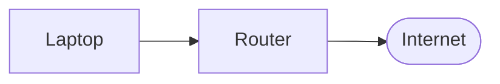
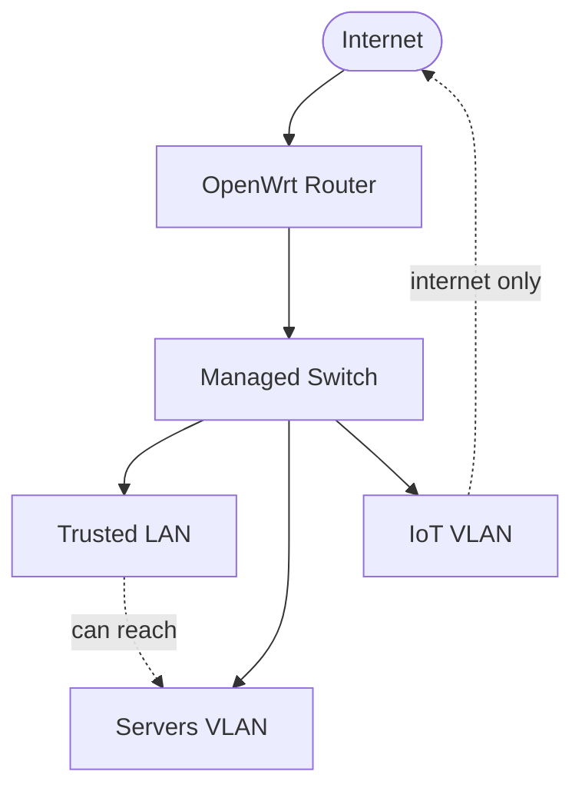
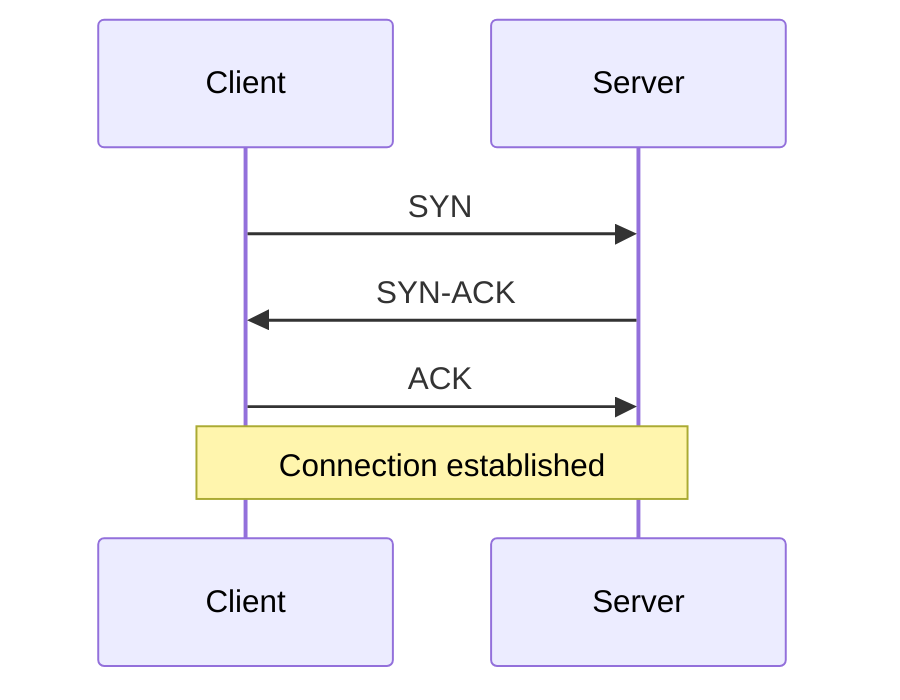
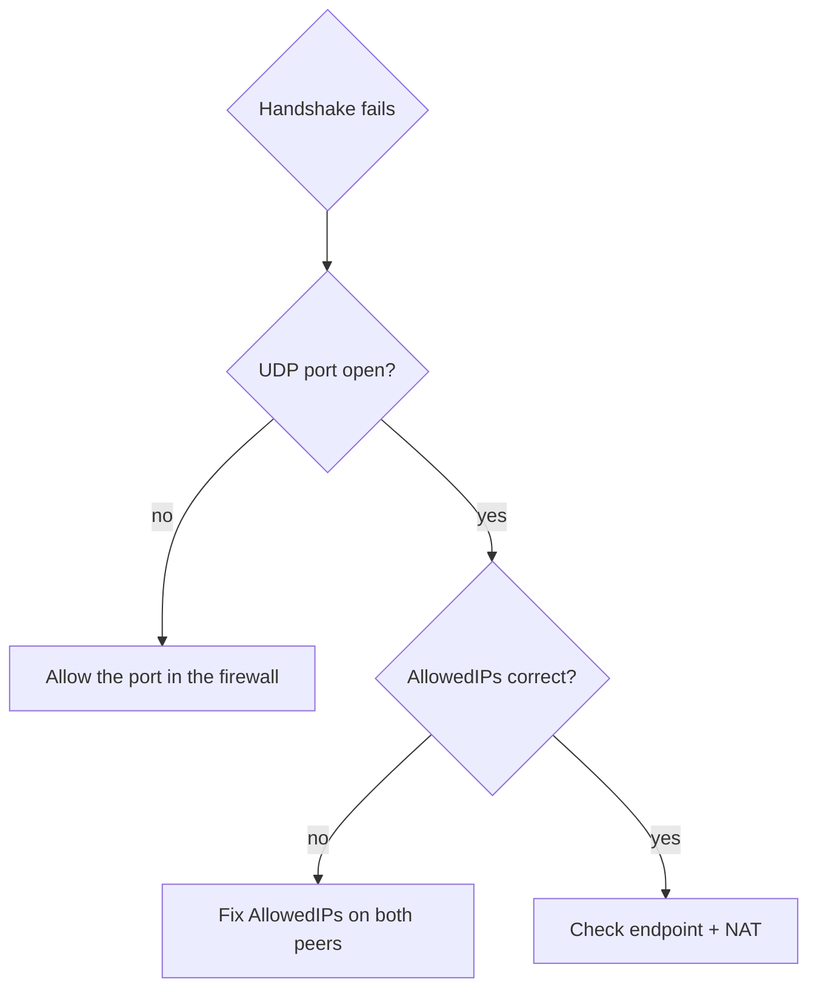

This site renders **[Mermaid](https://mermaid.js.org/)** diagrams: you write the diagram as
text in a fenced code block, and it becomes a real, rendered graphic. The diagrams follow the
site's light/dark theme automatically, stay version-controlled in your Markdown, and need no
image files — which makes them perfect for the network topology (Module 3), the backup
architecture (Module 4), and the remote-access design (Module 5) diagrams you'll produce.

## How to use it

Write a fenced code block with the language `mermaid`:

````markdown

````

That renders to:


That's the whole workflow — a `mermaid` code block anywhere in any `.md`/`.mdx` page under
`src/content/docs/` becomes a diagram. No image to upload, no path to manage.

## Network topology (the shape you'll use most)

`graph TD` (top-down) or `graph LR` (left-right) draws boxes and connections. Node shapes carry
meaning: `[ ]` is a box, `([ ])` a rounded pill (good for "the internet" or endpoints), `{ }` a
diamond (a decision or firewall), `[( )]` a cylinder (a database or store).

````markdown

````


- `-->` is a solid arrow; `-.->` (or `-. label .->`) is a dashed arrow — handy for showing an
  *allowed* path versus the default-deny between segments.
- Put a label on any arrow with `-- text -->` or `-. text .->`.
- `<br/>` inside a label makes a line break, so a box can show a name and a subnet.

## Sequence diagram (handshakes and protocol flows)

Perfect for the TCP/TLS handshakes from [Module 1](/modules/01-fundamentals/http-tls/) or a
WireGuard exchange in Module 5 — an alternative to the ASCII-art versions:

````markdown

````


## Flowchart (decision trees and runbooks)

Great for the troubleshooting flowcharts this curriculum keeps asking you to build — the
WireGuard diagnostic tree (Module 5), the boot-failure map (Module 2):

````markdown

````


## Tips

- **Preview as you write.** The dev server (`npm run dev`) hot-reloads, so you see the diagram
  update as you edit the text. VS Code also has Mermaid preview extensions.
- **Keep it readable.** Mermaid is for clarity, not photorealism. If a diagram gets too dense,
  split it into two.
- **When to use an image instead.** For an annotated *screenshot* (a Wireshark capture, a
  Grafana dashboard), use a real image — see the image options in your host's docs. Mermaid is
  for *structural* diagrams you'd otherwise draw by hand.
- **Full syntax** lives in the [Mermaid docs](https://mermaid.js.org/intro/) — there are many
  more diagram types (entity-relationship, Gantt, state, pie) if you ever need them.

## Why this fits the curriculum

Diagrams-as-text is the same philosophy as everything else here: it lives in git, it diffs
cleanly in a pull request, and it rebuilds automatically when your [CI/CD pipeline](/modules/07-automation/)
deploys the site. Your network diagram isn't a binary blob you re-export by hand every time the
network changes — it's text you edit alongside the configs it documents. That's infrastructure
thinking applied to documentation.
