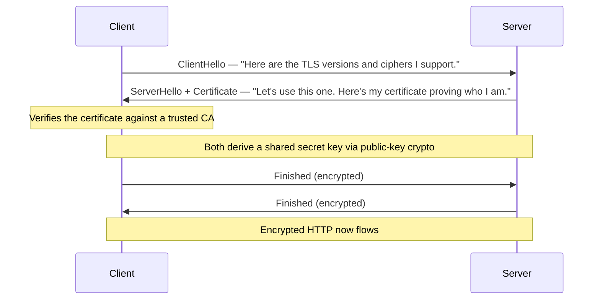

You now know how a packet finds a machine (Lesson 1.2) and how a name becomes an address
(Lesson 1.3). This lesson covers the **conversation** those packets carry when you load a web
page: **HTTP**, the language of the web, and **TLS**, the encryption that turns HTTP into the
padlocked HTTPS. Every web service you host in Module 6, every API you touch in your career,
speaks this. We'll do it partly *by hand* — typing raw HTTP — because seeing the plain text
demystifies it permanently.

## HTTP is just text

Here is the reassuring truth: HTTP is a simple, human-readable text protocol. A **request** is
text your browser sends; a **response** is text the server sends back. That's it. You can type it
yourself. Let's do exactly that.

### An HTTP request by hand

Using `nc` (netcat), open a raw TCP connection to a web server on port 80 and type an HTTP
request yourself:

```sh
nc example.com 80
```

Then type this (and press Enter twice at the end — the blank line signals "request done"):

```http
GET / HTTP/1.1
Host: example.com

```

The server responds with something like:

```http
HTTP/1.1 200 OK
Content-Type: text/html; charset=UTF-8
Content-Length: 1256
Date: Mon, 20 Jul 2026 14:00:00 GMT

<!doctype html>
<html>
...
```

That's a complete HTTP exchange, and *you* were the browser. This is worth doing once (it's
[Lab 2](/modules/01-fundamentals/labs/#lab-2--manual-http)) because it removes all the mystery: a
web request is a few lines of text over a TCP connection.

### Anatomy of the request

```
GET / HTTP/1.1        ← method, path, protocol version
Host: example.com     ← headers (one per line): metadata about the request
                      ← blank line: "headers are done"
(body, if any)        ← the payload, for methods like POST
```

- **Method** — what you want to do (see below).
- **Path** — which resource (`/`, `/about`, `/api/users`).
- **Headers** — metadata: which host you want (`Host:` — crucial, since one server hosts many
  sites), what formats you accept, cookies, authentication tokens.
- **Body** — data you're sending (for POST/PUT).

### Anatomy of the response

```
HTTP/1.1 200 OK       ← protocol version, status code, status text
Content-Type: ...     ← headers: metadata about the response
                      ← blank line
<the actual content>  ← the body: the HTML, JSON, image, etc.
```

## HTTP methods: the verbs

The **method** says what you want to do with a resource. The common ones:

| Method | Meaning | Example |
|---|---|---|
| **GET** | Retrieve something (no changes) | Loading a page |
| **POST** | Submit new data | Signing up, posting a comment |
| **PUT** | Replace/update a resource | Updating a record |
| **DELETE** | Remove a resource | Deleting a record |
| **HEAD** | Like GET but headers only, no body | Checking if something exists |

GET should never change anything on the server (it's "safe"); POST and friends do. This
distinction matters for security and for API design — you'll meet it constantly when you host
services and when you probe them in Module 8.

## Status codes: the response in a number

Every response starts with a three-digit **status code**. Learn the ranges and the common ones —
you'll read these daily in logs (recall your Module 0 pipeline lab counted `404`s and `500`s):

| Range | Meaning | Common examples |
|---|---|---|
| **1xx** | Informational | (rare in daily work) |
| **2xx** | Success | **200** OK, **201** Created, **204** No Content |
| **3xx** | Redirection | **301** Moved Permanently, **302** Found, **304** Not Modified |
| **4xx** | *Your* (client) error | **400** Bad Request, **401** Unauthorized, **403** Forbidden, **404** Not Found, **429** Too Many Requests |
| **5xx** | *Server* error | **500** Internal Server Error, **502** Bad Gateway, **503** Service Unavailable, **504** Gateway Timeout |

The most useful instinct: **4xx means the client (the request) did something wrong; 5xx means the
server broke.** When your Module 6 reverse proxy returns `502 Bad Gateway`, that number tells you
precisely where to look — the proxy is up (it answered) but the service behind it isn't responding.
Status codes are a diagnostic language; fluency in them saves hours.

## curl: HTTP from the command line

`nc` by hand is great for learning; `curl` is what you'll actually use. It speaks HTTP and HTTPS
and shows you everything:

```sh
curl https://example.com                 # fetch and print the body
curl -v https://example.com              # verbose: show the whole request AND response, headers and all
curl -I https://example.com              # HEAD request: response headers only
curl -L https://example.com              # follow redirects (3xx)
curl -X POST -d "name=alice" https://... # send a POST with data
curl -H "Authorization: Bearer TOKEN" https://...   # add a header
```

`curl -v` is the one to burn in. It prints the exact request it sent and the exact response,
including the TLS handshake details. It's your HTTP microscope, the way `dig` is your DNS
microscope. [Lab 2](/modules/01-fundamentals/labs/#lab-2--manual-http) has you annotate its output
line by line.

## TLS: the S in HTTPS

Plain HTTP is **unencrypted** — anyone between you and the server (on the WiFi, at the ISP) can
read and modify it. **TLS** (Transport Layer Security) wraps HTTP in encryption, and HTTP-over-TLS
is **HTTPS**. TLS provides three things, and it's worth being precise about which:

1. **Encryption** — nobody in the middle can *read* the traffic.
2. **Integrity** — nobody in the middle can *alter* it undetected.
3. **Authentication** — you can verify you're really talking to the server you think you are (not
   an impostor).

That third one — authentication — is where **certificates** come in, and it's the part people
misunderstand most.

### The TLS handshake

Before any encrypted HTTP flows, TLS does a **handshake** to set up the encryption. Simplified:



Two phases: first the two sides **agree on how to encrypt** and the server **proves its
identity** with a certificate; then they use public-key cryptography to establish a shared secret,
and everything after is encrypted. This all happens *after* the TCP handshake from Lesson 1.2 and
*before* the first HTTP request — and in Lesson 1.5 you'll see this exact sequence (TCP handshake,
then TLS handshake, then HTTP) laid out in a real Wireshark capture.

Recall the public/private key idea from your SSH lesson (Module 0.2)? TLS uses the same
foundation. The certificate carries the server's **public key**; only the server holds the
matching **private key**. That's how the client knows it's really talking to the server and can
set up encryption only the real server can decrypt.

### What a certificate actually proves (and doesn't)

A TLS **certificate** is a document that says "the public key inside belongs to `example.com`,"
**signed by a Certificate Authority (CA)** — a trusted third party your browser already trusts. The
chain of trust: your browser trusts a set of root CAs → those CAs sign certificates (sometimes via
intermediates) → the server presents its signed certificate → your browser checks the signature
chain leads back to a root it trusts. If it does, the padlock appears.

Here's the crucial, commonly-missed point:

:::caution[The padlock means "encrypted," not "trustworthy"]
A valid certificate proves you have an **encrypted** connection to **the domain in the address
bar** — nothing more. It does *not* mean the site is honest, safe, or run by good people. A
phishing site at `paypa1-login.com` can have a perfectly valid certificate and a green padlock; it
just proves you're securely connected to *the scammer's* domain. "Has HTTPS" and "is trustworthy"
are completely different questions. This distinction is fundamental to security work, and you'll
build on it in Module 8.
:::

### How you'll get certificates: Let's Encrypt

For decades, certificates cost money and were a hassle, so many sites skipped HTTPS. Then **Let's
Encrypt** made them **free and automatic** via the **ACME** protocol. In Module 6 you'll get real,
browser-trusted certificates for your self-hosted services automatically — including via the
**DNS-01 challenge** (proving you control the domain by creating a DNS record, which ties directly
back to Lesson 1.3). For now, just know: getting HTTPS is free and automatable, and there's no
excuse to run anything on plain HTTP.

## The whole page load, assembled

You now have every piece of loading `https://example.com`:

1. **DNS** (1.3): resolve `example.com` to an IP address.
2. **TCP handshake** (1.2): SYN → SYN-ACK → ACK to open a connection to that IP on port 443.
3. **TLS handshake** (1.4): agree on encryption, verify the certificate, establish keys.
4. **HTTP** (1.4): send `GET /`, receive `200 OK` and the HTML — now encrypted inside TLS.
5. The browser parses the HTML and repeats 1–4 for each image, script, and stylesheet.

That's it. Everything the web does is built on these steps. In the next lesson, you'll capture
this exact sequence and *watch each step happen* — which turns all of this from "things you read"
into "things you've seen."

## Quick self-check

1. Write, from memory, a minimal raw HTTP GET request. Why is the `Host:` header necessary?
2. What does a `502 Bad Gateway` from a reverse proxy tell you about where the problem is?
3. What's the difference in meaning between a 4xx and a 5xx status code?
4. Name the three things TLS provides. Which one do certificates deliver?
5. A phishing site shows a valid HTTPS padlock. What exactly does that padlock prove, and what
   does it *not* prove?
6. In what order do the DNS lookup, TCP handshake, TLS handshake, and first HTTP request happen?

**Next:** [Lesson 1.5 · Packet Capture →](/modules/01-fundamentals/capture/)
