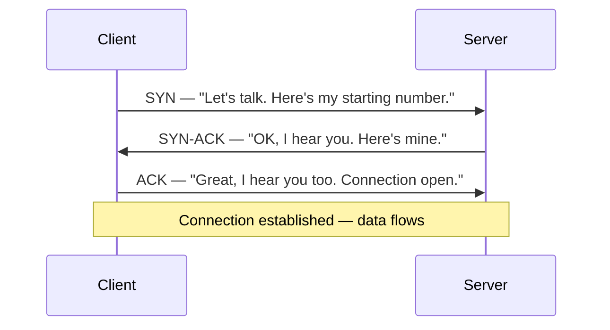

This is the most important lesson in the module. Networking is where fresh graduates are
weakest and where DevOps and security work lives. The good news: networking is not mysterious
once you see it as **layers** — a stack of independent problems, each solved by a different
protocol, each building on the one below. Learn the layers and you gain a superpower: when
something breaks, you can ask *"which layer is failing?"* and go straight to the cause instead
of flailing.

## Why layers? The key mental tool

Getting data from your laptop to a server across the world is a huge problem. So we split it
into smaller problems and stack the solutions. Each layer only has to talk to the layers
directly above and below it, and only has to solve *its* piece:

| Layer | The problem it solves | Example | Address it uses |
|---|---|---|---|
| **Application** | "What does this data *mean*?" | HTTP, DNS, SSH | (none — uses names) |
| **Transport** | "Get it to the right *program*, reliably" | TCP, UDP | Port number |
| **Network** | "Get it to the right *machine*, anywhere" | IP | IP address |
| **Link** | "Get it to the next device *on this wire*" | Ethernet, WiFi | MAC address |

(This is the practical four-layer TCP/IP model. You may also meet the seven-layer OSI model in
textbooks; the ideas are the same. What matters is the *layering*, not the exact count.)

**The debugging payoff:** every network problem lives at a specific layer. "Cannot resolve the
name" is Application (DNS). "Connection refused" is Transport (nothing listening on that port).
"No route to host" is Network (IP/routing). "Link is down" is, well, the Link layer. Trained
network people diagnose top-down or bottom-up through these layers rather than guessing.

Let's build the stack from the bottom up — the way a packet is actually assembled.

## Link layer: getting to the next device

The bottom layer moves data between devices **on the same local network** — your laptop to your
router, across one Ethernet cable or one WiFi link. The unit of data here is a **frame**.

Every network interface has a **MAC address** — a (supposedly) unique 48-bit hardware address
baked into the network card, written like `a4:83:e7:2c:1b:9f`. MAC addresses only matter
*locally*, on your own network segment; they don't travel across the internet.

```sh
ip link            # show your network interfaces and their MAC addresses
```

### ARP: the bridge from IP to MAC

Here's a puzzle. Your laptop wants to send data to `192.168.1.1` (your router). It knows the
*IP address*, but the Link layer needs a *MAC address* to build the frame. How does it get from
one to the other?

**ARP** (Address Resolution Protocol). Your laptop literally shouts to the whole local network:
*"Who has 192.168.1.1? Tell me your MAC address."* The device with that IP answers with its MAC.
Your laptop caches the answer and can now build the frame. You can watch this happen:

```sh
ip neigh           # show the ARP cache: IP → MAC mappings your machine has learned
```

ARP is a great first example of the layering idea in action: the Network layer (IP) and the Link
layer (MAC) are *different addressing systems*, and ARP is the glue between them. It's also,
notably, an old and trusting protocol — "ARP spoofing" (lying about which MAC owns an IP) is a
classic local-network attack you'll understand and defend against in Module 8.

## Network layer: getting to any machine, anywhere

The Link layer only reaches devices on your local wire. To reach a server across the world, you
need the **Network layer** and its star protocol: **IP** (Internet Protocol). The unit of data
is a **packet**, and every machine has an **IP address**.

### IPv4 addresses and subnets

An IPv4 address is four numbers, each 0–255: `192.168.1.50`. Under the hood it's just 32 bits.
An address has two parts: a **network** part (which network you're on) and a **host** part
(which specific machine on that network). A **subnet mask** — written in **CIDR notation** like
`/24` — says how many bits are the network part.

```
192.168.1.50/24
└──────┬─────┘ └┬┘
   the address   /24 means: the first 24 bits are the network,
                 the last 8 bits identify the host
```

So `192.168.1.0/24` is a network containing addresses `192.168.1.0` through `192.168.1.255`:

- `192.168.1.0` — the **network address** (names the network itself; not assigned to a host)
- `192.168.1.1` – `192.168.1.254` — usable **host addresses** (254 of them)
- `192.168.1.255` — the **broadcast address** (reaches every host on the subnet at once)

Common prefixes and their sizes (memorize the shape of this):

| CIDR | Netmask | Usable hosts | Typical use |
|---|---|---|---|
| `/24` | 255.255.255.0 | 254 | A normal home/office LAN |
| `/25` | 255.255.255.128 | 126 | Half a /24 |
| `/26` | 255.255.255.192 | 62 | A small subnet (you'll carve these in Module 3) |
| `/16` | 255.255.0.0 | 65,534 | A large private range |

Each smaller number = bigger network. Each step of +1 in the prefix *halves* the number of
hosts. [Lab 5](/modules/01-fundamentals/labs/#lab-5--subnet-drills) drills this until it's reflex,
because in Module 3 you'll design your own subnets and in the cloud (Module 9) you'll size VPC
subnets with exactly this math.

### Private addresses and why they exist

Some address ranges are **private** — reserved for internal networks and never routed on the
public internet:

- `10.0.0.0/8` (10.x.x.x)
- `172.16.0.0/12` (172.16.x.x – 172.31.x.x)
- `192.168.0.0/16` (192.168.x.x)

Your home network uses one of these (almost certainly `192.168.x.x`). Every home network reuses
the same private ranges, which is fine because they never collide on the internet — they're
walled off. The bridge between your private addresses and the public internet is **NAT**, coming
up shortly.

### Routing and the default gateway

A machine sending a packet asks one question: *"Is the destination on my own subnet, or somewhere
else?"*

- **Same subnet?** Send it directly (using ARP + the Link layer, as above).
- **Different subnet?** Send it to the **default gateway** — your router — and let it figure out
  the next hop. The router repeats the same question and forwards it along, router to router,
  until it arrives. That hop-by-hop forwarding *is* routing, and it's how a packet crosses the
  world.

```sh
ip route           # show your routing table; look for "default via ..." — that's your gateway
traceroute google.com   # show every router hop between you and the destination
mtr google.com     # traceroute + ping combined, live — a great diagnostic
```

Run `traceroute` once and watch your packet's journey: your router, your ISP, some backbone
networks, the destination's network. Every line is a real router forwarding your packet closer.
That's the Network layer doing its job across the whole internet.

## Transport layer: getting to the right program, reliably

IP gets a packet to the right *machine*. But a server runs many programs — a web server, an SSH
daemon, a database — so the packet needs to reach the right *program*. That's the **Transport
layer**, and it introduces **ports**.

A **port** is a number (0–65535) identifying a specific program's communication endpoint. Some
are conventional:

| Port | Service |
|---|---|
| 22 | SSH |
| 53 | DNS |
| 80 | HTTP |
| 443 | HTTPS |

So `192.168.1.50:443` means "the program listening on port 443 (a web server) on machine
`192.168.1.50`." An IP address plus a port is a **socket** — the full address of one endpoint of
a conversation.

```sh
ss -tunlp          # show which programs are listening on which ports on your machine
```

### TCP vs. UDP: the two ways to talk

There are two main transport protocols, and the choice between them is a real engineering
decision you'll make:

**TCP** (Transmission Control Protocol) — **reliable and ordered.** TCP guarantees that all your
data arrives, in order, without duplication — retransmitting anything lost. It's a *connection*:
both sides agree to talk, track the conversation, and tear it down cleanly. Used for anything
where correctness matters: web (HTTP), SSH, email, file transfer.

**UDP** (User Datagram Protocol) — **fast and fire-and-forget.** UDP just sends packets with no
guarantee of delivery, order, or duplication protection. No connection, no tracking. Why use it?
Because it's lightweight and low-latency, and some applications prefer speed and can tolerate (or
handle themselves) a little loss: DNS lookups, video calls, gaming, and — relevant to Module 5 —
**WireGuard**, which is UDP-based.

The trade-off in one line: **TCP is a phone call (connection established, both parties confirm
they hear each other); UDP is a postcard (you send it and hope it arrives).**

### The TCP three-way handshake

Because TCP is connection-oriented, it *establishes* a connection before any data flows, with a
famous three-step exchange:



**SYN → SYN-ACK → ACK.** After this handshake, both sides have agreed to a connection and data
flows reliably. You will *see this handshake with your own eyes* in Wireshark in Lesson 1.5 — it's
one of the most satisfying "oh, it's real" moments in the whole curriculum. When you understand
this handshake, "Connection refused" (the server actively said no), "Connection timed out" (no
answer at all), and "Connection reset" (an established connection was abruptly killed) stop being
vague errors and become precise statements about *where the handshake failed*.

## NAT: why your laptop's IP isn't your public IP

Here's a puzzle that ties the layers together. Your laptop has a private address like
`192.168.1.50`, which — as we said — is not routable on the public internet. Every device in your
home shares *one* public IP address from your ISP. So how do dozens of devices all browse the
internet through a single public address, with replies coming back to the right device?

**NAT** (Network Address Translation), performed by your router. When your laptop sends a packet
to the internet, the router:

1. Rewrites the packet's *source* from your private `192.168.1.50:54321` to the router's *public*
   IP and some port.
2. Records the mapping in a table.
3. When the reply comes back to that public IP and port, it looks up the table, rewrites the
   destination back to `192.168.1.50:54321`, and delivers it to your laptop.

The whole internet only ever sees your router's one public IP; the router quietly juggles which
internal device each connection belongs to. This is clever and it's why the internet didn't run
out of addresses years ago — but it has a big consequence for you:

:::note[NAT is why you can't just "connect to your home server"]
Because your devices hide behind NAT, machines on the internet **cannot initiate a connection
to them** — there's no public address to reach, and the router only knows how to route replies to
connections that started *inside*. This is why reaching your homelab from outside is a real
problem with real solutions, and it's the entire reason Module 5 (overlay networks like
WireGuard, Tailscale, and Cloudflare Tunnel) exists. NAT also quietly breaks or complicates many
things; half of "why won't this connect" questions in networking trace back to it.
:::

## The whole stack, in one sentence

When your laptop sends data to a web server: the **Application** layer (HTTP) says what you want,
the **Transport** layer (TCP) wraps it with a port and reliability, the **Network** layer (IP)
wraps that with source and destination addresses, the **Link** layer (Ethernet/WiFi) wraps *that*
with MAC addresses to reach your router — and your router's **NAT** rewrites the source so the
reply can find its way home. Each layer wraps the one above like an envelope inside an envelope.
In Lesson 1.5 you'll open a real captured packet and see every envelope, nested exactly like this.

## Quick self-check

1. Name the four layers and the address each one uses.
2. A colleague reports "Connection refused." Which layer is that, and what does it tell you?
3. In `10.20.30.0/26`: how many usable hosts, and what's the broadcast address?
4. What does ARP do, and between which two layers does it bridge?
5. When would you choose UDP over TCP? Give a concrete example.
6. Walk through the TCP three-way handshake. What does each of SYN, SYN-ACK, ACK mean?
7. Explain, to a non-engineer, why a server on the internet can't directly connect to your
   laptop at home — and name the module that solves it.

**Next:** [Lesson 1.3 · DNS →](/modules/01-fundamentals/dns/)
