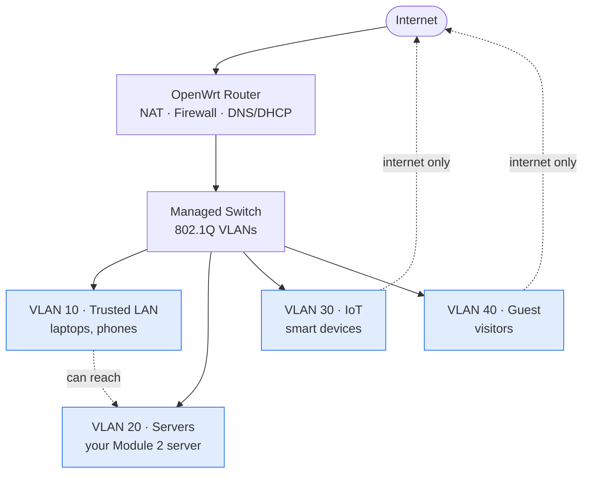

Consumer routers hide the network behind a wizard. OpenWrt removes the curtain: it's just
Linux, and every concept from [Module 1](/modules/01-fundamentals/) — DHCP, DNS, NAT, routing,
firewalling — becomes a config you wrote yourself. By the end of this module you'll know
exactly what happens to every packet in your home, and your network will be segmented the way
a security-conscious professional builds one.

This is where Module 1's theory becomes something you operate. You watched a DNS query in a
packet capture; now you'll *run the DNS server*. You learned what a subnet is; now you'll
*carve four of them* and enforce firewall policy between them.

## The network you'll build

Here's the segmented topology this module builds toward — the same diagram you'll produce as
your [deliverable](#deliverable), drawn as text with Mermaid:

(New to Mermaid? See [Diagrams as Text](/guides/diagrams/).)

## What you need

- **One OpenWrt-supported router** — check the [OpenWrt hardware table](https://openwrt.org/toh/start)
  *before buying*. Many capable used models cost under $30. See the [hardware guide](/guides/hardware/).
- Ideally a **cheap managed switch** (~$25) for the VLAN labs — many consumer routers have
  limited VLAN support.
- Optionally a **Raspberry Pi** for a dedicated DNS resolver (Pi-hole / AdGuard Home / Unbound).
- Your **Module 2 server**, which will get a fixed address and a proper DNS name here.
- A **USB-to-serial (TTL) adapter** (~$8) is cheap insurance for recovering a bricked router.

:::caution[The one module that can take your household offline]
Unlike earlier modules, changing your router affects everyone's internet. Two ways to keep the
peace: do disruptive work when nobody needs the network, and consider **learning on a second
router** first (double-NAT'd behind your ISP box) before replacing the main one. Every lesson
here flags the "don't lock yourself out" details.
:::

## The lessons

| Lesson | Topic | Time |
|---|---|---|
| [3.1 · OpenWrt from Scratch](/modules/03-network/openwrt/) | Flashing safely, recovery, the "router is Linux" model | 4–6 hrs |
| [3.2 · The Services Your ISP Box Hid](/modules/03-network/services/) | DHCP, DNS, local names, NAT & port forwarding | 4–6 hrs |
| [3.3 · Segmentation](/modules/03-network/segmentation/) | VLANs, a four-segment topology, inter-VLAN firewall rules | 6–8 hrs |
| [3.4 · Watching the Network](/modules/03-network/watching/) | Captures on the router, DHCP/DNS/ARP in the wild, privacy | 3–4 hrs |
| [Labs](/modules/03-network/labs/) | The five graded exercises | 6–10 hrs |

Total: roughly **30–40 hours**, or 3–4 weeks part-time.

## Checkpoint

- [ ] My network runs on a router I flashed and configured myself
- [ ] DHCP and DNS for my LAN are services I run and can debug
- [ ] My network has at least three segments with enforced firewall policy between them
- [ ] I can capture traffic on the router and explain what I see
- [ ] I have a current, accurate network diagram
- [ ] I can restore my router config from a backup (tested!)

## Deliverable

**A network diagram + config repo**: your topology diagram (drawn in Mermaid, like the one
above), your exported router config with secrets stripped, a firewall-policy table, and a blog
post explaining your segmentation choices and what each VLAN is protected from. Full spec in
[Lab 5](/modules/03-network/labs/#lab-5--the-network-diagram--writeup).

## Resources

- [OpenWrt documentation](https://openwrt.org/docs/start) — start with the Table of Hardware
- [OpenWrt user guide](https://openwrt.org/docs/guide-user/start) — network, firewall, DHCP/DNS
- Pi-hole ([docs.pi-hole.net](https://docs.pi-hole.net/)) / AdGuard Home for the resolver lab
- Ars Technica's classic "How routers work" pieces for background
