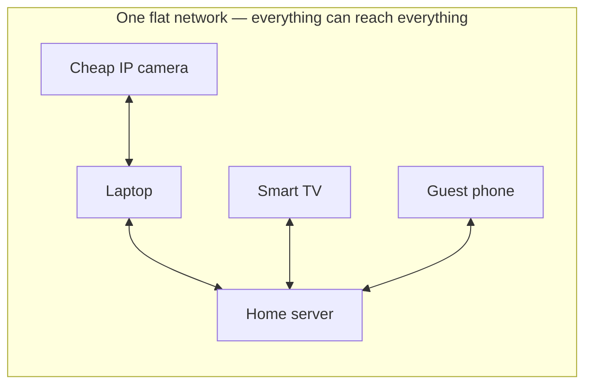
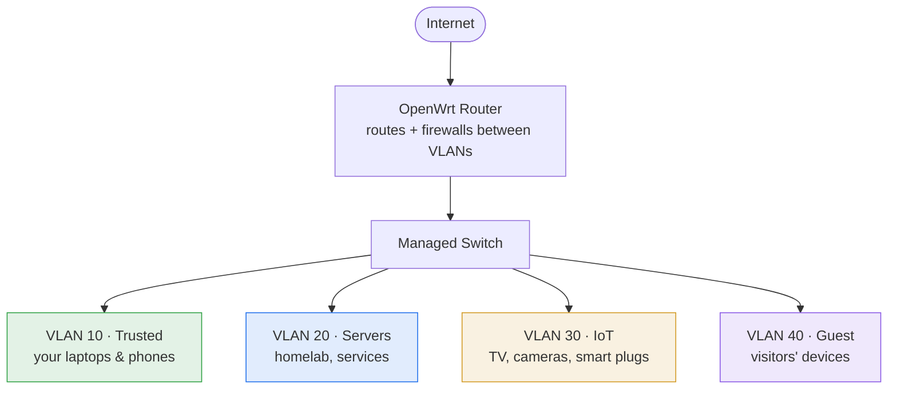
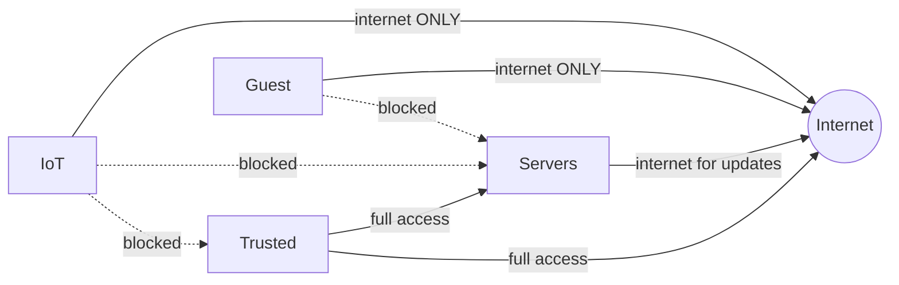

This is the security heart of the module. Most home networks are **flat** — every device can
talk to every other device. Your laptop, your smart TV, a guest's phone, and your server all sit
on one big network with no walls between them. That's convenient and dangerous: it's exactly how
malware spreads laterally once *anything* on the network is compromised. **Segmentation** —
splitting the network into isolated zones with controlled paths between them — is the single
cheapest, highest-impact security control you can apply, and this lesson builds it.

## The problem with flat networks

Picture the flat network everyone starts with:



The cheap IP camera runs firmware that hasn't been patched in years. The moment it's compromised
— and internet-of-things devices are compromised constantly — the attacker is on the *same
network* as your server, your laptop, and your backups, with nothing in the way. This is not
hypothetical; lateral movement from a weak IoT device is a standard attack path, and flat
networks are why ransomware spreads through an organization in minutes.

## The fix: VLANs

A **VLAN** (Virtual LAN) lets one physical switch and router act as if they were several
separate networks. Devices on VLAN 30 can't see devices on VLAN 20 unless you *explicitly* allow
it through the firewall — even though they share the same physical switch.

The mechanism (recall the Link layer from [Lesson 1.2](/modules/01-fundamentals/tcpip/)):
**802.1Q tagging** adds a small VLAN ID tag to each Ethernet frame. The switch and router read
the tag and keep each VLAN's traffic separate. Two terms you'll meet:

- A **tagged** (or "trunk") port carries multiple VLANs, each frame labeled with its VLAN ID —
  this is the link between your router and your managed switch.
- An **untagged** (or "access") port belongs to one VLAN; the device plugged in (a laptop, a
  camera) doesn't know VLANs exist — the switch adds/strips the tag for it.

:::note[This is why the parts list suggested a managed switch]
Plain "dumb" switches don't understand VLAN tags. A cheap **managed switch** (~$25) does, which
is why the [hardware guide](/guides/hardware/) recommends one. Some OpenWrt routers can do basic
VLANs on their own ports too — check your device — but a managed switch makes the labs much
cleaner.
:::

## A sensible four-segment topology

Here's a home topology that maps to how real networks are segmented — by **trust level**:



| VLAN | Zone | What's on it | Trust |
|---|---|---|---|
| 10 | Trusted | Your laptops, phones | High |
| 20 | Servers | Homelab, self-hosted services | High, but isolated |
| 30 | IoT | Smart TV, cameras, plugs — the risky stuff | Low |
| 40 | Guest | Visitors' devices | Untrusted |

## The policy: who may talk to whom

Segmentation is only as good as the **firewall rules between the zones**. The router routes
*and firewalls* between VLANs; you write the policy. A sensible default, expressed as intent:



Stated in words — the policy table you'll actually implement and put in your deliverable:

| From ↓ / To → | Trusted | Servers | IoT | Guest | Internet |
|---|---|---|---|---|---|
| **Trusted** | — | ✅ allow | ✅ allow | (n/a) | ✅ |
| **Servers** | ⛔ deny¹ | — | ⛔ | ⛔ | ✅ (updates) |
| **IoT** | ⛔ deny | ⛔ deny | — | ⛔ | ✅ only |
| **Guest** | ⛔ deny | ⛔ deny | ⛔ | — | ✅ only |

¹ Servers generally shouldn't *initiate* connections into your Trusted zone; you reach *into*
servers from Trusted, not the other way around. This "servers can't reach back" rule limits what
a compromised service can do.

The principle underneath: **default deny between zones, allow only the specific paths you need**
— the exact same posture as the host firewall in [Lesson 2.3](/modules/02-server/hardening/),
now applied at the network level. IoT and Guest get the internet and nothing internal. Your
trusted devices reach your servers. A compromised camera reaches *nothing that matters*.

## Building it on OpenWrt (the shape of the work)

You'll do the detailed steps in [Lab 3](/modules/03-network/labs/#lab-3--the-great-segmentation);
here's the mental model so the lab makes sense. On OpenWrt, VLAN segmentation is three layers of
config working together:

1. **Switch/ports:** define the VLANs and which physical ports are tagged (trunk to the switch)
   vs. untagged (access ports for devices). On a managed switch, mirror the same VLAN IDs.
2. **Interfaces:** create an OpenWrt network interface per VLAN, each with its own subnet and its
   own DHCP pool (Lesson 3.2) — e.g. Servers on `192.168.20.0/24`, IoT on `192.168.30.0/24`.
   This is where your [subnet drills](/modules/01-fundamentals/labs/#lab-5--subnet-drills) pay off.
3. **Firewall zones:** put each interface in a firewall **zone**, then write the inter-zone rules
   from the policy table — deny by default, allow the specific flows.

Everything is UCI text under `/etc/config/network` and `/etc/config/firewall` (Lesson 3.1), so
the whole segmented design ends up in git as part of your deliverable.

## Verify the walls actually hold

Like hardening in Module 2, segmentation is only real if you *test* it. From a device on each
VLAN, prove the policy — using the tools from Modules 1–2:

```sh
# From an IoT-VLAN device: can it reach a server? (it must NOT)
ping 192.168.20.10          # expect: no reply / blocked
nmap 192.168.20.0/24        # expect: nothing reachable

# From a Trusted device: can it reach the server? (it must)
ping 192.168.20.10          # expect: reply
```

If a device on the IoT VLAN can reach your server, your firewall rules don't match your diagram —
find and fix the gap. This "prove the isolation" step is [Lab 3](/modules/03-network/labs/#lab-3--the-great-segmentation)'s
core, and it's a preview of the adversarial testing you'll do across VLANs in
[Module 8](/modules/08-security/)'s purple-team exercise.

## Quick self-check

1. Why is a flat network a security problem? Give the IoT-camera scenario in your own words.
2. What does 802.1Q tagging actually add to an Ethernet frame, and who reads it?
3. What's the difference between a tagged (trunk) port and an untagged (access) port?
4. Why do IoT and Guest devices get "internet only" and nothing internal?
5. Why shouldn't servers be able to *initiate* connections into your Trusted zone?
6. How do you *prove* your segmentation works, and what does failure look like?

**Next:** [Lesson 3.4 · Watching the Network →](/modules/03-network/watching/)
