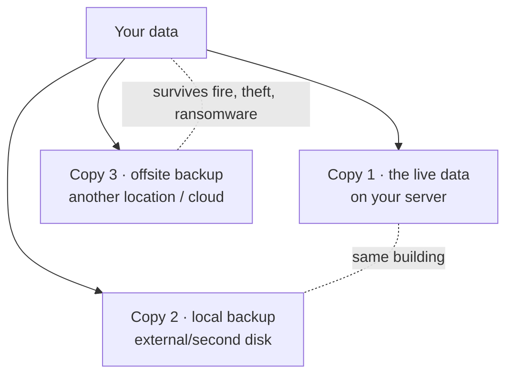

Everyone agrees backups matter. Almost nobody tests them. This lesson gives you a real backup
*discipline* — the 3-2-1 rule, a proper tool (restic), automation, and the one practice that
turns "I have backups" from a hope into a fact: **regularly restoring from them.** The graded
exercise for this module ([Lab 3](/modules/04-storage/labs/#lab-3--the-restore-drill)) is to
delete something important and restore it, timed. That single drill is what separates people who
*have* backups from people who merely *think* they do.

## The only backup that counts is one you've restored

Start with the hard truth. An untested backup is **Schrödinger's backup**: you don't know if it
works until you try to restore, and the worst time to discover it doesn't is during an actual
disaster. Real incidents where the backups turned out to be empty, corrupt, or missing the one
thing that mattered are distressingly common. So the mindset this lesson builds is:

> A backup is not "done" when the backup job succeeds. It's "done" when you have *restored* from
> it and verified the data is intact.

Everything below serves that principle.

## The 3-2-1 rule

The industry's durable rule of thumb for backup that actually survives disasters:



- **3 copies** of your data (the live one + two backups).
- **2 different media** (e.g. the server's disk + an external drive) — so one failing medium
  doesn't take both.
- **1 offsite** — a copy in a *different physical location*, so a fire, flood, theft, or a
  ransomware attack that reaches everything on your LAN can't destroy every copy.

Applied honestly to a homelab: your live data (1), an automated backup to an external/second disk
(2, different medium), and an offsite copy (3) — to a cloud object store, or a drive you keep at
work/a relative's house, or a small VPS. You don't need all of it on day one, but you should know
which of the three you have and which you're still missing.

:::caution[Ransomware is why "offsite" increasingly means "offline or immutable"]
Modern ransomware deliberately hunts for and encrypts backups it can reach over the network —
including your NAS and mounted backup drives. So the offsite copy is strongest when it's
**offline** (unplugged when not backing up) or **immutable** (the storage won't let anything,
even you, overwrite it for a set period). This is a real, current threat you'll model in
[Module 8](/modules/08-security/); design your 3-2-1 with it in mind.
:::

## restic: the backup tool you'll actually keep using

You *could* back up with `rsync` or `tar`, but a purpose-built tool gives you three things that
matter enormously: **encryption**, **deduplication**, and **snapshots**. The two great
open-source choices are **restic** and **borg**; this curriculum uses **restic** (single binary,
cross-platform, many storage backends), but borg is equally good.

What restic gives you:

- **Encryption** — the backup repository is encrypted, so the backup destination (an external
  drive, a cloud bucket) never sees your plaintext data. Essential for offsite/cloud copies.
- **Deduplication** — it only stores each unique chunk once, so daily backups of mostly-unchanged
  data take very little extra space. You can keep many restore points cheaply.
- **Snapshots** — each backup is a point-in-time snapshot you can browse and restore from
  individually. Deleted a file three days ago? Restore it from the snapshot from four days ago.

### The core workflow

```sh
sudo apt install restic

# One-time: initialize an encrypted repository (here, on a mounted backup disk)
restic init --repo /mnt/backup

# Back up: snapshot some directories into the repo
restic -r /mnt/backup backup /etc /home /srv

# See your snapshots (restore points)
restic -r /mnt/backup snapshots

# Restore: pull a snapshot's contents back out
restic -r /mnt/backup restore latest --target /tmp/restore-test

# Housekeeping: keep a sensible history, drop the rest
restic -r /mnt/backup forget --keep-daily 7 --keep-weekly 4 --prune
```

restic supports many backends for the offsite copy — an SFTP server, S3-compatible object
storage (Backblaze B2, AWS S3, or your own Minio), and more — so the same tool does both your
local and offsite copies. (You'll map this to cloud object storage in
[Module 9](/modules/09-career/).)

### What to back up (and what not to)

Back up **data and configuration**, not the whole OS:

- **Yes:** `/etc` (your configs), your services' data (`/srv`, databases, container volumes),
  `/home`, and — the whole point of this curriculum — your git repositories and documentation.
- **Not necessary:** the operating system itself and installed packages. Why? Because
  [Module 7](/modules/07-automation/) makes the OS **reproducible from code** (Ansible) — you can
  rebuild the server from a playbook, so you only need to back up the *irreplaceable* data, not
  the reinstallable system. This is a preview of a powerful idea: *cattle, not pets.* You don't
  lovingly back up a server you can recreate in minutes; you back up the data you can't.

## Automate it — a backup you have to remember isn't a backup

Manual backups get forgotten exactly when life gets busy. Automate with a **systemd timer**
(from [Lesson 2.2](/modules/02-server/anatomy/)) or cron so it runs nightly without you. The
shape:

- A small script that runs `restic backup ...` for your local repo and `restic backup ...` for
  the offsite repo, then `restic forget --prune` to manage retention.
- A systemd timer that runs it nightly.
- **Notification on failure** — a silent backup failure is how you *think* you're protected for
  months and aren't. Have the job alert you (email/push) if it fails. You'll build real alerting
  in [Module 8](/modules/08-security/); even a simple failure email now is worth it.

Secrets note ([Lesson 0.4](/modules/00-toolkit/git/)): the restic repository password and any
cloud credentials must **not** be committed to git. Keep them in a protected file or a secrets
manager — a habit [Module 7](/modules/07-automation/) formalizes with `sops`/age.

## Testing restores: the graded discipline

Here it is — the practice that makes all the above real. **On a schedule, restore from your
backup and verify the data.** Not "check the backup job ran green" — actually pull data back and
confirm it's correct and complete.

Your [Lab 3](/modules/04-storage/labs/#lab-3--the-restore-drill) is exactly this, done for real:

1. Pick something important that's backed up.
2. **Delete it** (or restore into a separate location and compare — safer while learning).
3. Restore it from the backup.
4. **Time the whole thing** and verify the restored data is intact.
5. Write the restore **runbook** ([Lesson 0.5](/modules/00-toolkit/writing/)) as you go.

Timing it matters because "how long to recover" (your **RTO**, recovery time objective) is a real
operational number — during an outage, knowing "I can be back in 20 minutes" versus "I have no
idea" is the difference between calm and panic. Doing this drill once, deliberately, in the calm
of a lab, is worth more than any amount of reading. It's also the module's deliverable, precisely
because it's the thing that most cleanly demonstrates real operational maturity to an employer.

## Quick self-check

1. Why is an untested backup called "Schrödinger's backup"?
2. State the 3-2-1 rule and what each number defends against.
3. Why does modern ransomware make "offline or immutable" the strong form of the offsite copy?
4. What three things does a tool like restic give you over plain `rsync`/`tar`?
5. Why don't you need to back up the operating system itself in this curriculum?
6. What exactly does it mean to "test a restore," and why time it?

**Next:** [Lesson 4.4 · Virtualization →](/modules/04-storage/virtualization/)
