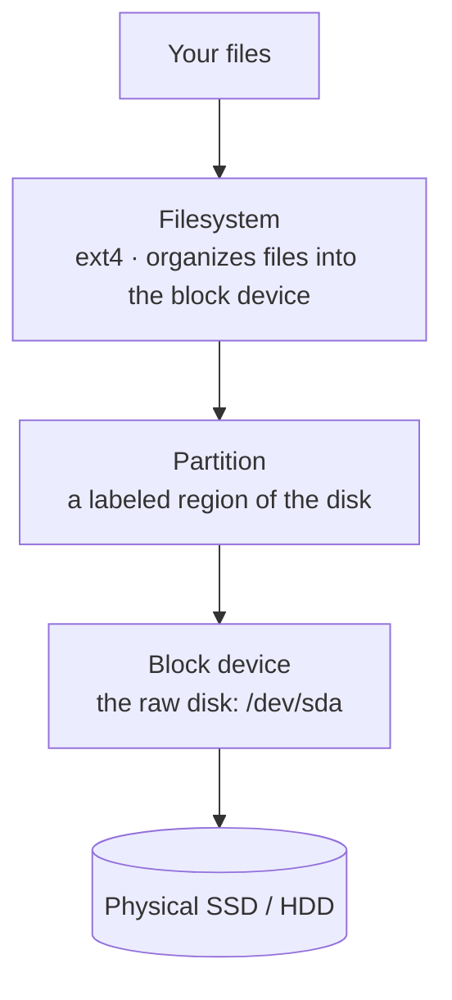
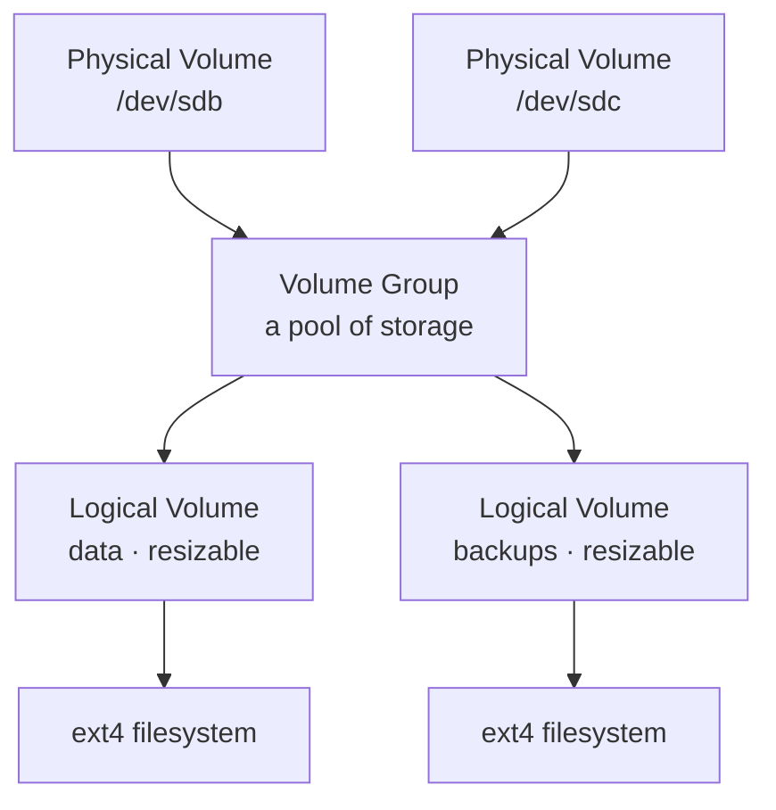

You've used storage since Module 0 without looking underneath it. Now you look. This lesson
builds an accurate model of the layers between a physical disk and the files you read and write —
**block device → partition → filesystem → mount point** — plus **LVM** (the layer that lets you
resize storage without pain) and **SMART** (how a disk warns you it's dying). These are the
fundamentals every later storage decision rests on.

## The layers, top to bottom

When you save a file, it passes through a stack of abstractions. Understanding the stack is what
lets you reason about storage instead of cargo-culting commands:



- A **block device** is the raw disk as the OS sees it — a big array of fixed-size blocks. It
  shows up under `/dev` (e.g. `/dev/sda`, `/dev/nvme0n1`). "Block" because it's read and written
  in blocks, not byte-by-byte.
- A **partition** is a labeled region of a block device, so one disk can be divided into parts
  (e.g. `/dev/sda1`, `/dev/sda2`). The partition *table* records the layout.
- A **filesystem** is the structure written *into* a partition that organizes it into files and
  directories with names, permissions, and timestamps (the [Lesson 0.1](/modules/00-toolkit/shell/)
  stuff). Without a filesystem, a partition is just undifferentiated blocks.
- A **mount point** is the directory where a filesystem is attached into the single Linux tree
  (recall from [Lesson 1.1](/modules/01-fundamentals/machine/) that Linux has one tree from `/`).

## Seeing your storage

Start by looking at what's there. These are safe, read-only:

```sh
lsblk                    # tree view of disks, partitions, sizes, and mount points — start here
lsblk -f                 # also show filesystem type and label
sudo fdisk -l            # detailed partition tables for every disk
df -h                    # mounted filesystems and their free space (Lesson 2.4)
sudo blkid               # UUIDs and types of every partition
mount | column -t        # what's currently mounted, and how
cat /proc/mounts         # the authoritative live mount list
```

`lsblk` is the one to reach for first — it shows the whole hierarchy (disk → partitions →
mounts) at a glance. Learn to read it and you can orient on any machine's storage in seconds.

:::danger[Identify the right device before EVERY write operation]
Everything below writes to disks, and naming the wrong device destroys whatever is on it — the
same lesson as `dd` in [Lesson 2.1](/modules/02-server/bare-metal/). `/dev/sda` might be your
system disk; `/dev/sdb` your spare. Run `lsblk` immediately before any partition/format command
and confirm the size and mount status match the disk you *mean* to touch. Do these labs on spare
disks only.
:::

## Partitioning: GPT and the tools

A new disk needs a **partition table**. The modern standard is **GPT** (GUID Partition Table),
which replaced the old MBR scheme — GPT supports large disks and many partitions and is what you
should use for anything new.

Tools you'll meet:

- **`fdisk`** — the classic interactive partition editor (`sudo fdisk /dev/sdX`). Menu-driven:
  `p` print, `n` new, `d` delete, `w` write-and-quit, `q` quit-without-saving.
- **`parted`** / **`gparted`** — alternatives; `gparted` is graphical if you ever want it.

The typical flow to prepare a fresh spare disk (in [Lab 1](/modules/04-storage/labs/#lab-1--disk-surgery)):
create a GPT table, add one partition spanning the disk, then put a filesystem on it (next
section). For a data disk you often don't even need multiple partitions — one big one is fine.

## Filesystems: ext4 (and friends)

Once you have a partition, you write a **filesystem** into it. On Linux the reliable default is
**ext4** — mature, fast, and what you'll use unless you have a reason not to:

```sh
sudo mkfs.ext4 /dev/sdX1        # create an ext4 filesystem on partition sdX1 (ERASES it)
```

Other filesystems you'll hear about: **xfs** (great for large files/servers), **btrfs** and
**ZFS** (advanced, with snapshots and checksums — ZFS is covered in
[Lesson 4.2](/modules/04-storage/redundancy/)), and **FAT32/exFAT** (for USB sticks shared with
Windows/Mac). For your homelab data, ext4 is the sensible default.

### What "journaling" buys you

ext4 is a **journaling** filesystem: before making a change, it records its intent in a journal.
If power is lost mid-write, on reboot the filesystem replays or discards the journal to stay
consistent, rather than being left half-written and corrupt. This is why a modern Linux box
survives an unclean shutdown far better than old filesystems did — worth knowing when you
reason about what a sudden power loss does (and why a UPS, from the hardware guide, still helps).

## Mounting: attaching a filesystem into the tree

A filesystem isn't usable until it's **mounted** at a directory:

```sh
sudo mkdir /mnt/data                       # a directory to mount onto
sudo mount /dev/sdX1 /mnt/data             # attach it — now files under /mnt/data live on that disk
df -h /mnt/data                            # confirm it's mounted
sudo umount /mnt/data                      # detach it
```

A manual `mount` doesn't survive a reboot. To mount automatically at boot, add an entry to
**`/etc/fstab`** — and always reference the filesystem by its **UUID** (from `blkid`), not
`/dev/sdX`, because device names can change between boots but UUIDs are stable:

```
# /etc/fstab — one line per filesystem to mount at boot
UUID=xxxx-xxxx  /mnt/data  ext4  defaults  0  2
```

:::caution[A bad fstab can stop the machine booting]
An incorrect `/etc/fstab` entry can make the system fail to boot (it may drop to an emergency
prompt waiting for a device that isn't there). After editing fstab, test with
`sudo mount -a` (which mounts everything in fstab) *before* rebooting — if it errors, fix it
now, not after a reboot leaves you at a rescue prompt. This is the storage version of Module 2's
"keep a way back."
:::

## LVM: storage you can resize

Here's a problem raw partitions have: they're rigid. If `/mnt/data` fills up, you can't easily
make its partition bigger without repartitioning. **LVM** (Logical Volume Management) solves
this by adding a flexible layer between the disk and the filesystem. Three concepts:



- **Physical Volume (PV):** a disk or partition handed to LVM.
- **Volume Group (VG):** a pool made of one or more PVs — combined free space.
- **Logical Volume (LV):** a virtual "partition" carved from the VG, which you format and mount.
  Crucially, an LV can be **grown** (and, with ext4, even while mounted) as long as the VG has
  free space — or you add another disk to the VG to get more.

You chose LVM during the Debian install ([Lesson 2.1](/modules/02-server/bare-metal/)) for
exactly this reason. The commands you'll use in [Lab 1](/modules/04-storage/labs/#lab-1--disk-surgery):

```sh
sudo pvcreate /dev/sdX1                     # make a partition into a physical volume
sudo vgcreate data-vg /dev/sdX1             # create a volume group from it
sudo lvcreate -L 10G -n data-lv data-vg     # carve a 10G logical volume
sudo mkfs.ext4 /dev/data-vg/data-lv         # format it
# ...later, when it's filling up:
sudo lvextend -L +5G /dev/data-vg/data-lv --resizefs   # grow it by 5G AND the filesystem, live
```

That last command — growing storage *while it's in use* — is the payoff, and it feels like magic
the first time. It's why "use LVM" is standard advice for any server whose storage needs might
change (i.e. all of them).

## SMART: hearing a disk announce its death

Disks fail. Good news: they usually warn you first. **SMART** (Self-Monitoring, Analysis and
Reporting Technology) is built into drives and tracks health indicators — reallocated sectors,
read errors, temperature. You read it with `smartmontools`:

```sh
sudo apt install smartmontools
sudo smartctl -a /dev/sdX              # full health report for a drive
sudo smartctl -H /dev/sdX              # just the overall health assessment (PASSED/FAILED)
sudo smartctl -t short /dev/sdX        # run a short self-test
```

The indicators that predict failure — rising **Reallocated_Sector_Ct**, **Pending sectors**,
read error rates — are worth learning to spot. A drive reporting reallocated sectors is telling
you to replace it *before* it dies. On a real server you'd have `smartd` email you on trouble;
checking SMART is part of keeping storage healthy, and it sets up *why* you want the redundancy
and backups of the next two lessons: because "the disk warned me" and "the disk already died"
both happen, and you plan for both.

## Quick self-check

1. Name the four layers from a physical disk up to your files, in order.
2. Which command gives you a tree view of disks, partitions, and mount points?
3. Why should `/etc/fstab` reference filesystems by UUID rather than `/dev/sdX`?
4. What are LVM's Physical Volume, Volume Group, and Logical Volume, and what does LVM let you
   do that raw partitions don't?
5. What does journaling protect you from?
6. What is SMART, and what would make you decide to replace a drive proactively?

**Next:** [Lesson 4.2 · Redundancy Is Not Backup →](/modules/04-storage/redundancy/)
