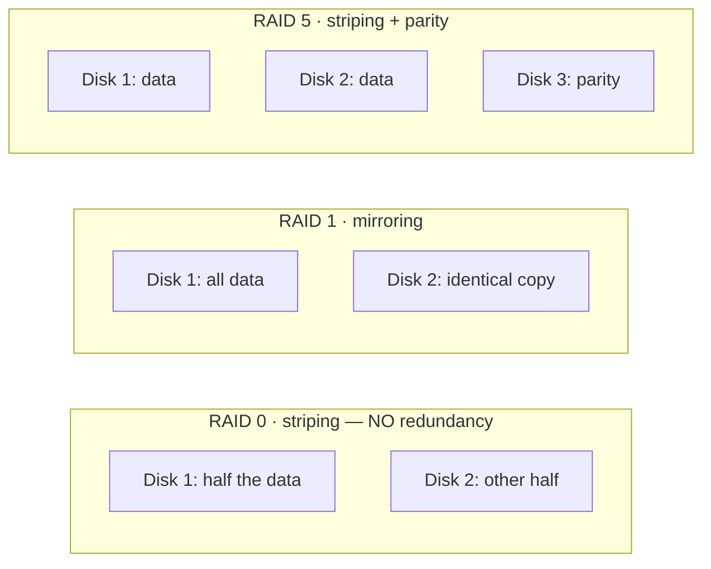

This lesson teaches **RAID** — combining disks so your server survives a drive failure — and
then spends equal effort making sure you never confuse it with **backup**. That confusion is
one of the most expensive mistakes in the industry: organizations have lost everything because
they thought "we have RAID" meant "our data is safe." It doesn't. RAID and backup solve
*different problems*, and a serious setup has both.

## The problem RAID solves

Disks fail. In [Lesson 4.1](/modules/04-storage/disks/), SMART warns you one might be dying — but
sometimes a disk just dies, now, with no warning. If your data lives on that one disk, it's gone
(until you restore from backup, with downtime). **RAID** (Redundant Array of Independent Disks)
combines multiple physical disks so that the *failure of a disk doesn't take your data offline*.
The system keeps running; you replace the dead disk; life continues.

The key word is **running** — RAID is about *availability*, staying up through a hardware
failure. Hold that thought; it's the whole distinction with backup.

## The RAID levels you need to know

There are several RAID "levels"; you need to understand the trade-off each makes between
capacity, performance, and redundancy. The three that matter:

| Level | How it works | Survives | Capacity cost | Use when |
|---|---|---|---|---|
| **RAID 0** | Data split ("striped") across disks for speed | **Nothing** — one disk dies, all data lost | None (all usable) | You want speed and have backups; **never** for data you care about |
| **RAID 1** | Every disk holds an identical copy (mirror) | 1 disk failure (in a 2-disk mirror) | Half (2 disks = 1 disk of space) | Simple, robust redundancy — great for a homelab |
| **RAID 5** | Data + **parity** striped across 3+ disks | 1 disk failure | One disk's worth | More usable space across many disks |
| **RAID 6** | Like 5 but double parity | 2 disk failures | Two disks' worth | Larger arrays where rebuild risk matters |

:::caution[RAID 0 is not redundancy — it's the opposite]
Despite the name "RAID," level 0 has **no** redundancy — it *increases* your risk, because now
*two* disks can kill your data instead of one. It's for speed only. If someone says "I put my
data on RAID 0," they have made things worse, not better. For a homelab, **RAID 1 (a mirror)**
is the simple, correct starting point.
:::

**Parity**, in RAID 5/6, is a clever bit of math: extra information that lets the array
reconstruct a failed disk's contents from the surviving disks. It's how RAID 5 gives you
single-disk redundancy while only "spending" one disk of capacity across the whole array.

## How you'll actually build it

Two common routes on Linux, both fine for the homelab:

- **`mdadm`** — Linux's software RAID. It works with any disks and sits below the filesystem: you
  create an array (e.g. `/dev/md0`) from your disks, then put a filesystem (or LVM) on it. Mature
  and universal.
- **ZFS** — a combined filesystem *and* volume manager that does RAID (it calls it RAIDZ /
  mirror) itself, with major extra benefits (below). Increasingly the homelab favorite.

You'll build a two-disk mirror and deliberately fail a disk in
[Lab 2](/modules/04-storage/labs/#lab-2--kill-a-mirror) — watching an array degrade and rebuild
is the moment RAID stops being abstract.

## ZFS: redundancy plus integrity

**ZFS** deserves special mention because it solves problems plain RAID doesn't, and homelabbers
love it. Beyond mirroring/RAIDZ, ZFS gives you:

- **Checksums on every block.** ZFS detects **silent corruption** ("bit rot" — data quietly
  degrading on disk) that ordinary RAID can't even see, and with redundancy, *repairs* it
  automatically. This is a genuinely bigger deal than it sounds: plain RAID will happily mirror
  corrupted data.
- **Scrubs.** A periodic `zpool scrub` reads everything and fixes detected errors against the
  redundant copies — proactive health-checking of your data.
- **Snapshots.** Near-instant, space-efficient point-in-time copies of a filesystem (more on why
  that matters below and in [Lesson 4.4](/modules/04-storage/virtualization/)).

The trade-off is that ZFS wants RAM and a bit more learning. For a 16 GB micro PC it's very
usable, and the data-integrity guarantees are why it's worth the effort. If you'd rather keep it
simple first, an `mdadm` mirror + ext4 is perfectly respectable; you can graduate to ZFS later.

## The distinction that defines this module

Now the point everything has been building toward. RAID and backup feel similar — both involve
"extra copies" — but they defend against **completely different disasters**:

| | RAID / redundancy | Backup |
|---|---|---|
| **Protects against** | A disk **hardware failure** | Deletion, corruption, ransomware, mistakes, fire/theft |
| **Keeps you** | **Running** (no downtime) | **Recoverable** (restore, with downtime) |
| **When a file is deleted** | Instantly deleted on *all* mirrored disks | Still safe in yesterday's backup |
| **When ransomware hits** | Encrypts the data on *all* disks equally | Clean copy survives, if it's offline/immutable |
| **Copies are** | Live, synchronized, same place | Separate, point-in-time, ideally elsewhere |

The killer insight: **RAID copies happen instantly and everywhere.** If you `rm` an important
file, or ransomware encrypts it, or a bad script corrupts it — RAID *faithfully replicates the
deletion/corruption to every disk in the array, immediately.* Mirroring a mistake doesn't undo
it. RAID has zero memory of "yesterday"; a backup is precisely a memory of yesterday.

:::danger[The one-sentence version — memorize this]
**RAID keeps you running through a disk failure. Backups save you from deletion, ransomware,
and yourself. They are different problems, and you need both.** Being able to say this clearly
(the checkpoint asks you to) marks you as someone who actually understands storage — a
surprising number of working engineers don't.
:::

RAID is not optional *and* not sufficient. It handles the disk-dies case elegantly so you don't
take downtime for a hardware fault. But the moment the threat is anything other than hardware —
a human, a bug, malware, a fire — only a real backup saves you. That's the next lesson, and it's
the one with the graded "delete something and restore it" drill.

## Quick self-check

1. What single problem does RAID solve, and what's the key word for what it gives you?
2. Why is RAID 0 not redundancy? What is it for?
3. What's the difference between RAID 1 and RAID 5 in what they cost and what they survive?
4. What does ZFS give you beyond RAID, and why does "checksums on every block" matter?
5. You accidentally `rm -rf` an important directory on a RAID 1 mirror. Is the data recoverable
   from the mirror? Why or why not?
6. State the RAID-vs-backup distinction in one sentence.

**Next:** [Lesson 4.3 · Backups: The 3-2-1 Discipline →](/modules/04-storage/backups/)
