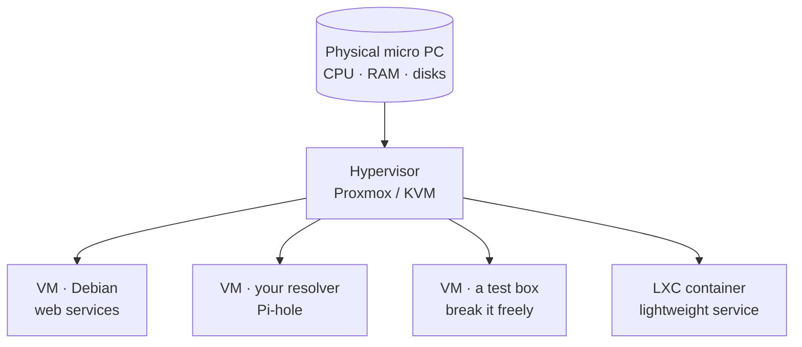
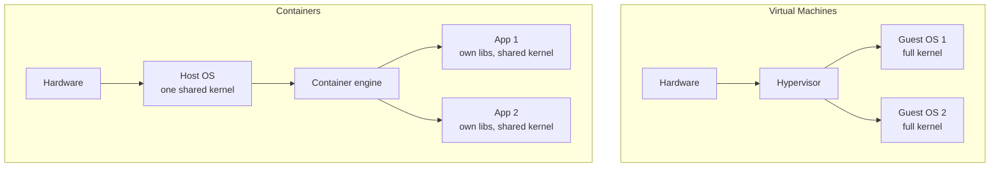

So far your server has been one machine running things directly. This lesson introduces the
abstraction that all of modern infrastructure — and the entire cloud — is built on:
**virtualization**, running many independent virtual computers on one physical machine. You'll
turn your micro PC into a **hypervisor** with Proxmox, and gain something transformative for
learning: the ability to create, snapshot, break, and roll back whole machines *without fear*,
because a broken VM is one click away from a known-good snapshot.

## What virtualization is

A **hypervisor** is software that lets one physical computer run multiple **virtual machines
(VMs)** — each with its own virtual CPU, memory, disk, and network, each running its own
operating system, all isolated from each other. The hypervisor divides the real hardware
(recall the CPU/RAM/disk from [Lesson 1.1](/modules/01-fundamentals/machine/)) among them and
keeps them from interfering.



This is not a niche technique — **it is how the cloud works.** When you rent a server from AWS,
Google, or Hetzner ([Module 9](/modules/09-career/)), you're getting a VM on someone's
hypervisor. Learning virtualization here means the cloud stops being mysterious: it's this, at
enormous scale, rented by the hour.

### KVM: the engine

On Linux, the core virtualization technology is **KVM** (Kernel-based Virtual Machine), built
into the kernel, usually driven via **QEMU**. KVM is a **type-1-style** hypervisor: VMs run
nearly at native speed because the CPU has hardware virtualization support (make sure it's
enabled in your micro PC's BIOS — [Lesson 2.1](/modules/02-server/bare-metal/)). You *can* drive
KVM/QEMU by hand, but a management layer makes it pleasant — which is where Proxmox comes in.

## Proxmox VE: your homelab hypervisor

**Proxmox VE** is a Debian-based platform that wraps KVM and LXC in a clean web interface. It's
free, hugely popular in homelabs, and mirrors how enterprise virtualization platforms work. With
it you get:

- A **web UI** to create, start, stop, clone, and console into VMs — no commands required.
- **Snapshots** — save a VM's exact state and roll back to it instantly (the killer feature for
  fearless learning).
- **Backups** — scheduled VM backups (complementing your restic file backups from Lesson 4.3).
- **LXC containers** — lightweight virtualization (below) alongside full VMs.

### The move: rebuild your server as a hypervisor

Here's how this module reshapes your homelab. Your [Module 2 server](/modules/02-server/) was
Debian on bare metal. Now you'll **install Proxmox on the micro PC** instead, and recreate that
Debian server as a *VM inside Proxmox*. Your Module 2 skills make this fast — you already know how
to install and harden Debian; now you do it inside a VM. The physical machine becomes a platform
that can run *many* such machines.

The benefits are immediate:

- Run your web services, your DNS resolver, and a throwaway test box as separate, isolated VMs on
  one micro PC.
- Snapshot before any risky change and roll back in seconds if it goes wrong.
- Try things you'd never risk on a machine you cared about — because you can always roll back.

## The VM lifecycle — and the habit it builds

Working with VMs follows a lifecycle. Learn it, and one habit within it that will save you
repeatedly:

```sh
# (Conceptually — most of this is clicks in the Proxmox UI)
create   → install an OS into a fresh VM (from an ISO, like Module 2)
start / stop / reboot → run it, like any machine
snapshot → save the VM's exact current state, named (e.g. "before-upgrade")
...make a risky change...
rollback → if it broke, restore the snapshot — instantly back to "before-upgrade"
clone    → copy a VM to make another just like it
destroy  → delete a VM you're done with
```

:::tip[Snapshot before every risky change — make it reflex]
The single most valuable virtualization habit: **before any change you're unsure about — an
upgrade, a config experiment, installing something sketchy — take a snapshot.** If it works,
delete the snapshot. If it breaks, roll back and it's as if you never touched it. This turns
"I'm scared to try that on my server" into "let me just snapshot and try it," which is how you
learn fast. You'll rely on this constantly for the rest of the curriculum, and
[Lab 5](/modules/04-storage/labs/#lab-5--snapshot-safety-net) drills it.
:::

## VMs vs. containers: the distinction you must get right

You'll hear "VM" and "container" constantly, often confused. They're both ways to run isolated
workloads, but they work differently, and knowing when to use each is real engineering judgment.



- A **VM** virtualizes the **hardware**. Each VM runs its own full operating system, including
  its own kernel. Strong isolation, but heavier — each VM carries a whole OS (more RAM, slower to
  start).
- A **container** virtualizes the **operating system**. Containers share the host's single kernel
  and just package an app with its libraries. Much lighter and faster to start, but weaker
  isolation (they trust the shared kernel — recall kernel vs. user space from
  [Lesson 1.1](/modules/01-fundamentals/machine/)).

| | VM | Container |
|---|---|---|
| Virtualizes | Hardware | The OS (shared kernel) |
| Contains | A full OS + kernel | An app + its libraries |
| Isolation | Strong | Lighter |
| Weight / startup | Heavier / slower | Lighter / near-instant |
| Good for | Different OSes, strong isolation, "a whole machine" | Packaging and running individual services at scale |

The right instinct: **VMs when you want a whole isolated machine or strong separation;
containers when you want to package and run a service efficiently.** Proxmox offers both KVM VMs
and lightweight **LXC** system containers, so you can feel the difference directly.

This lesson deliberately puts **VMs first** so containers make sense by contrast. In
[Module 6](/modules/06-selfhosting/) you'll meet **Docker** — application containers — and run
your actual self-hosted services in them, because that's how service deployment is done today.
But you'll understand *why* containers are lighter than VMs, and when a full VM is still the
right call, because you built on real hypervisors first. (The optional Kubernetes/k3s track later
builds on this too — but note the curriculum's stance: fundamentals first, orchestration only
once the fundamentals are solid.)

## Quick self-check

1. What is a hypervisor, and why does understanding it demystify "the cloud"?
2. What does Proxmox add on top of raw KVM/QEMU?
3. Describe the VM lifecycle, and name the one habit within it that saves you repeatedly.
4. What's the core difference between a VM and a container, in terms of what each virtualizes?
5. When would you choose a VM over a container, and vice versa?
6. Why does this lesson teach VMs before containers?

**Next:** [The Labs →](/modules/04-storage/labs/) — where you partition, mirror, restore, and
virtualize for real.
