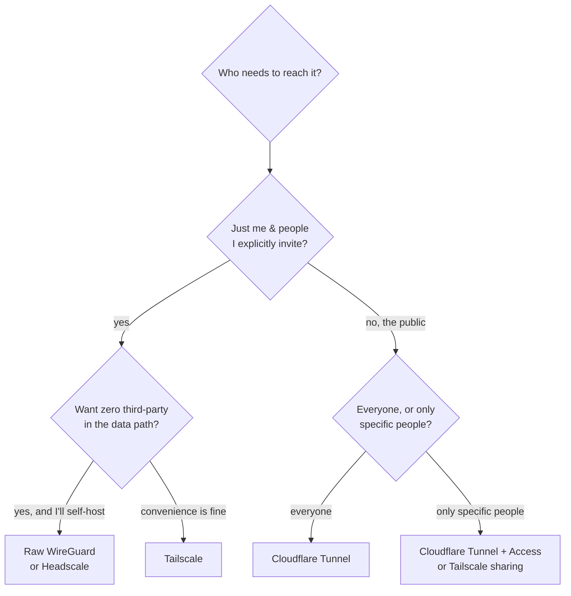

You now have three ways to reach your homelab: hand-rolled **WireGuard**, **Tailscale**, and
**Cloudflare Tunnel** (+ Access). The skill that matters most isn't operating any one of them —
it's *choosing the right one for a given need and being able to justify the choice*. That's what
senior engineers do all day: not "which tool is best" (a beginner's question) but "which tool
fits *this* requirement, and what am I trading away." This short lesson turns your three tools
into a decision framework, and teaches you to record decisions the way professionals do — with an
**ADR**.

## There is no "best" — only "best for this"

Each tool is excellent at what it's for and wrong for the others. The decision hinges on two
questions: **who needs access?** and **what are you willing to trust?**



Stated as a table — the reasoning you'll put in your deliverable:

| Need | Best fit | Why |
|---|---|---|
| Reach my server/LAN from anywhere, just me | **Tailscale** | Zero config, NAT traversal, end-to-end; no ports |
| Same, but no third-party control plane at all | **Raw WireGuard** or **Headscale** | Full self-hosting; you accept the manual/ops cost |
| Publish a blog/portfolio to the whole world | **Cloudflare Tunnel** | Public reach, no open ports, IP hidden, DDoS/WAF |
| A service reachable anywhere but only by named people | **CF Tunnel + Access**, or **Tailscale share** | Identity-gated; zero-trust |
| Appear to browse "from home" on café WiFi | **Tailscale exit node** / WG full-tunnel | Routes all traffic through home |

Most real homelabs use **more than one**: Tailscale for private admin access to everything, and
Cloudflare Tunnel for the one or two things published to the public. That's not indecision — it's
using each tool for its strength.

## The trade-off axes to reason about

When you justify a choice, these are the dimensions that actually matter — the vocabulary of the
decision:

- **Who's in the data path?** WireGuard/Tailscale keep traffic end-to-end between your devices;
  Cloudflare sees plaintext at its edge ([Lesson 5.3](/modules/05-overlay/cloudflare/)). Sensitive
  data argues for the former.
- **Inbound exposure.** All three beat port forwarding, but confirm it: the payoff is *zero open
  ports*, which you'll prove by scanning your own IP.
- **Self-hosting vs. convenience.** Raw WireGuard and Headscale are fully yours but more work;
  Tailscale and Cloudflare are managed and easier but depend on a third party. This curriculum
  values understanding both.
- **Public vs. private.** Is the audience "the world," "some named people," or "only me"?
- **Operational cost.** Who maintains it, what breaks it, what happens when a token leaks (a
  question you'll threat-model in [Module 9](/modules/09-career/)).

## Recording the decision: the ADR

Here's a professional habit worth starting now. When you make an architectural choice, you write
an **Architecture Decision Record (ADR)** — a short document capturing *what* you decided, *why*,
what you *considered*, and what you're *trading away*. ADRs are widely used in industry because
six months later nobody remembers why a decision was made, and "we chose X because Y, having
rejected Z for reason W" is enormously valuable to future-you and to teammates.

An ADR is short and has a standard shape ([Lesson 0.5](/modules/00-toolkit/writing/) writing
skills applied):

```markdown
# ADR-001: Remote access for the homelab

## Status
Accepted — 2026-07-20

## Context
I need to (a) administer my homelab from anywhere, and (b) publish my
documentation site publicly. My devices sit behind home NAT; opening
inbound ports is unacceptable.

## Decision
- Tailscale for private admin access to all devices (SSH, dashboards).
- Cloudflare Tunnel + Access for the public site and one gated service.
- No port forwarding anywhere.

## Alternatives considered
- Raw WireGuard: rejected for daily use (manual key mgmt, NAT hassle);
  kept as the thing I understand underneath Tailscale.
- Port forwarding: rejected — inbound exposure to the whole internet.
- Headscale: deferred — will revisit to remove the Tailscale dependency.

## Consequences
- Cloudflare can see plaintext for the public site (acceptable: nothing
  secret there).
- I depend on two third-party control planes; documented as a risk.
- Zero inbound ports — verified by external nmap (see deliverable).
```

Writing this for *your* homelab is [Lab 5](/modules/05-overlay/labs/#lab-5--the-design-doc) and
the module deliverable. It's also, not coincidentally, exactly the kind of document that makes an
interview go well: "walk me through how you'd give secure remote access to internal services"
has a crisp, real answer you've actually implemented and can point at.

:::note[Why this matters beyond the homelab]
Overlay networks and zero-trust access are among the hottest areas in infrastructure and security
hiring right now — "we're moving off the VPN to zero-trust" is a sentence being said in
thousands of companies. Having *built* WireGuard by hand, *operated* Tailscale with ACLs, and
*published* a service through an identity-gated tunnel — and being able to reason about the
trade-offs in an ADR — puts you ahead of most candidates, who have only ever used a corporate VPN
client someone else configured.
:::

## Quick self-check

1. Why is "which VPN tool is best?" the wrong question? What's the right one?
2. For each: private admin access / public blog / a service only three named people may reach —
   which tool, and why?
3. Which tools keep traffic end-to-end, and which one sees your plaintext at its edge?
4. What is an ADR, and what four things does it capture?
5. Why do many real homelabs run more than one of these tools at once?
6. Why is this skill especially relevant to the current job market?

**Next:** [The Labs →](/modules/05-overlay/labs/) — where you build all three, break one on
purpose, and prove zero open ports.
