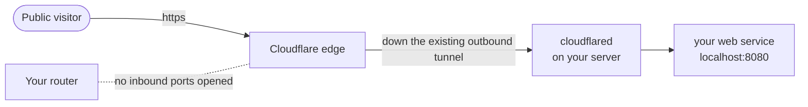

WireGuard and Tailscale give *you* (and people you invite) private access to your homelab.
But sometimes you want the opposite: to publish a service to the **whole public internet** — a
blog, a portfolio, a thing you want anyone to reach — *without* exposing your home IP or opening
a port. **Cloudflare Tunnel** does exactly that, using an inverted model that's worth
understanding because it's a genuinely different and clever approach. It's how you'll put your
[Module 6](/modules/06-selfhosting/) site on the real internet safely.

## The inverted model

Port forwarding ([Lesson 3.2](/modules/03-network/services/)) works by accepting *inbound*
connections — the dangerous part. Cloudflare Tunnel flips it: a small daemon on your server
(**cloudflared**) makes an **outbound** connection to Cloudflare's network and keeps it open.
Public visitors hit Cloudflare; Cloudflare sends their requests back down that already-open
outbound tunnel to your server. **Your router never accepts an inbound connection, and no port is
ever opened.**



Contrast the three models you now know:

| | Inbound connection? | Port opened? | Who can reach it |
|---|---|---|---|
| **Port forwarding** | Yes (dangerous) | Yes | Anyone (+ every attacker scanning) |
| **WireGuard / Tailscale** | Outbound-ish / coordinated | No (with Tailscale) | Only people in your tailnet |
| **Cloudflare Tunnel** | **Outbound only** | **No** | The public — but Cloudflare screens first |

## Publishing a service

The flow (you'll do it in [Lab 4](/modules/05-overlay/labs/#lab-4--publish)):

1. You need a **domain** managed through Cloudflare (the ~$10/yr from the
   [hardware guide](/guides/hardware/) — the one recurring cost worth paying, needed here and in
   Module 6).
2. Install `cloudflared` on your server and authenticate it to your Cloudflare account.
3. Create a tunnel, and map a public hostname to a local service:
   ```sh
   cloudflared tunnel create homelab
   # route a public name to a service running locally on the server:
   cloudflared tunnel route dns homelab blog.yourdomain.com
   # config maps blog.yourdomain.com -> http://localhost:8080
   cloudflared tunnel run homelab
   ```
4. Visitors go to `https://blog.yourdomain.com`; Cloudflare terminates TLS at its edge and pipes
   the request down the tunnel to your local service. You didn't open a port or reveal your home
   IP.

Run `cloudflared` as a systemd service ([Lesson 2.2](/modules/02-server/anatomy/)) so it starts
at boot and stays up — the same service-management skills, applied.

## Cloudflare Access: identity in front of the service

A tunnel makes a service *public*. Often you want it reachable from anywhere but only by
*specific people* — your family's photo app, an admin dashboard. **Cloudflare Access** puts an
identity check *in front* of the service, at Cloudflare's edge, before the request ever reaches
your server:

- You write a policy: "only these email addresses" (or a Google/GitHub group, etc.).
- Unauthenticated visitors get an SSO/one-time-code login at Cloudflare's edge.
- Only after they pass does the request go down the tunnel to your service.

This is **zero-trust access** in the textbook sense: no implicit trust based on network location,
identity checked on every request, enforcement at the edge. It's the same philosophy as
Tailscale's ACLs ([Lesson 5.2](/modules/05-overlay/tailscale/)), applied to public-facing
services — and it's exactly the model behind the corporate "access gateway" products you'll meet
in industry. Standing one up yourself is a strong, demonstrable skill.

## The honest trade-off

Nothing is free, and a defining habit of this curriculum is *naming the trade-off out loud*
rather than pretending a tool is pure upside:

:::caution[What you gain, and what you give up]
Cloudflare Tunnel + Access gives you real protection: no open ports, your home IP hidden,
Cloudflare's DDoS/WAF filtering in front, and identity-gated access. **What you give up:**
Cloudflare terminates your TLS, which means **Cloudflare can see your traffic in plaintext** at
its edge. You're trusting a third party with your data in exchange for their protection and
convenience. That may be entirely reasonable for a public blog (there's nothing secret), and less
so for sensitive internal services (where Tailscale, which keeps traffic end-to-end between your
own devices, is the better fit). The point isn't that one is "good" and another "bad" — it's that
you should be able to *state the trade-off* and choose deliberately. That judgment is
[Lesson 5.4](/modules/05-overlay/choosing/).
:::

## Where each tool naturally fits

This lesson completes the toolkit; the pattern is becoming clear:

- **Private access for you and invited people** → WireGuard / Tailscale (end-to-end, no third
  party in the data path).
- **Public service for everyone** → Cloudflare Tunnel (published safely, no open ports).
- **Semi-private — reachable from anywhere but only by specific people** → Cloudflare Tunnel +
  Access, *or* Tailscale sharing.

You'll formalize this decision in the next lesson and prove the payoff in the labs — including the
satisfying moment of scanning your own home IP from outside and seeing **zero open ports** while
your services are nonetheless reachable through these tunnels.

## Quick self-check

1. How does Cloudflare Tunnel let the public reach your service without opening any inbound port?
2. What's the difference between what a tunnel does and what Cloudflare *Access* adds on top?
3. Why is Cloudflare Access an example of "zero-trust" access?
4. State the core trade-off of Cloudflare Tunnel honestly — what you gain and what you give up.
5. For a public blog vs. a sensitive internal admin panel, which access method fits each, and why?
6. What one recurring cost does this approach require, and where else in the curriculum do you
   need it?

**Next:** [Lesson 5.4 · Choosing →](/modules/05-overlay/choosing/)
