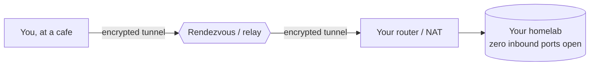

The old way to reach your homelab from outside was **port forwarding** — punching a hole in
your firewall and hoping ([Lesson 3.2](/modules/03-network/services/) taught it, then told you
to stop). The modern way is **overlay networks**: encrypted tunnels that make your devices
reachable from anywhere *without exposing anything to the internet*. This is also exactly how
corporate **zero-trust** access works today, which makes this module directly résumé-relevant —
the concepts here are what "secure remote access" means at real companies.

You'll build the hard way first — raw **WireGuard**, by hand — so that the easy ways
(**Tailscale**, **Cloudflare Tunnel**) are understood rather than magical. By the end you'll
reach your homelab from a coffee shop with **zero inbound ports open**, and you'll be able to
argue which tool fits which job.

## The problem, restated

Recall **NAT** from [Lesson 1.2](/modules/01-fundamentals/tcpip/): your devices sit behind your
router's single public IP, and the internet **cannot initiate connections inward**. That's a
security feature — but it means reaching your own server from outside is a real problem. The
three approaches in this module solve it three different ways, and understanding the trade-offs
between them is the actual skill.

## The lessons

| Lesson | Topic | Time |
|---|---|---|
| [5.1 · WireGuard from First Principles](/modules/05-overlay/wireguard/) | Keys, peers, AllowedIPs, hand-written configs, debugging | 6–8 hrs |
| [5.2 · Tailscale](/modules/05-overlay/tailscale/) | WireGuard made easy: NAT traversal, MagicDNS, ACLs | 4–5 hrs |
| [5.3 · Cloudflare Tunnel](/modules/05-overlay/cloudflare/) | Publishing services with zero inbound ports, plus Access | 4–5 hrs |
| [5.4 · Choosing](/modules/05-overlay/choosing/) | The architecture decision, and writing an ADR | 2–3 hrs |
| [Labs](/modules/05-overlay/labs/) | The five graded exercises | 6–10 hrs |

Total: roughly **25–35 hours**, or 3–4 weeks part-time.

## Why build WireGuard by hand first

You could skip straight to Tailscale and have a working tunnel in ten minutes. This module
deliberately doesn't, for the same reason [Module 2](/modules/02-server/) built a server by hand
before [Module 4](/modules/04-storage/) virtualized it: **the magic tools are only safe to rely
on once you understand what they automate.** When a Tailscale connection misbehaves, the person
who hand-configured WireGuard knows exactly what's underneath and can debug it; the person who
only ever clicked "connect" is stuck. Build the primitive, then appreciate the abstraction.

## Checkpoint

- [ ] I can hand-write a working WireGuard config and explain every line
- [ ] I can debug a failed handshake methodically, not by config-shuffling
- [ ] My devices form a tailnet with ACLs I wrote
- [ ] I have a public service reachable through a tunnel with zero inbound ports open
- [ ] An external port scan of my home IP shows nothing
- [ ] I've written an ADR comparing the three approaches for my own use

## Deliverable

**A remote-access design doc** (ADR format) comparing WireGuard, Tailscale, and Cloudflare
Tunnel — with your topology diagram (Mermaid) and the external `nmap` scan proving the
zero-open-ports claim. It doubles as interview material: "walk me through your homelab access
design." Full spec in [Lab 5](/modules/05-overlay/labs/#lab-5--the-design-doc).

## Resources

- [WireGuard conceptual overview](https://www.wireguard.com/#conceptual-overview) — short and canonical
- Tailscale's [*How NAT traversal works*](https://tailscale.com/blog/how-nat-traversal-works) — a networking education in itself
- [Cloudflare Tunnel docs](https://developers.cloudflare.com/cloudflare-one/connections/connect-networks/)
- [Headscale](https://headscale.net/) — the open-source, self-hostable Tailscale control server
