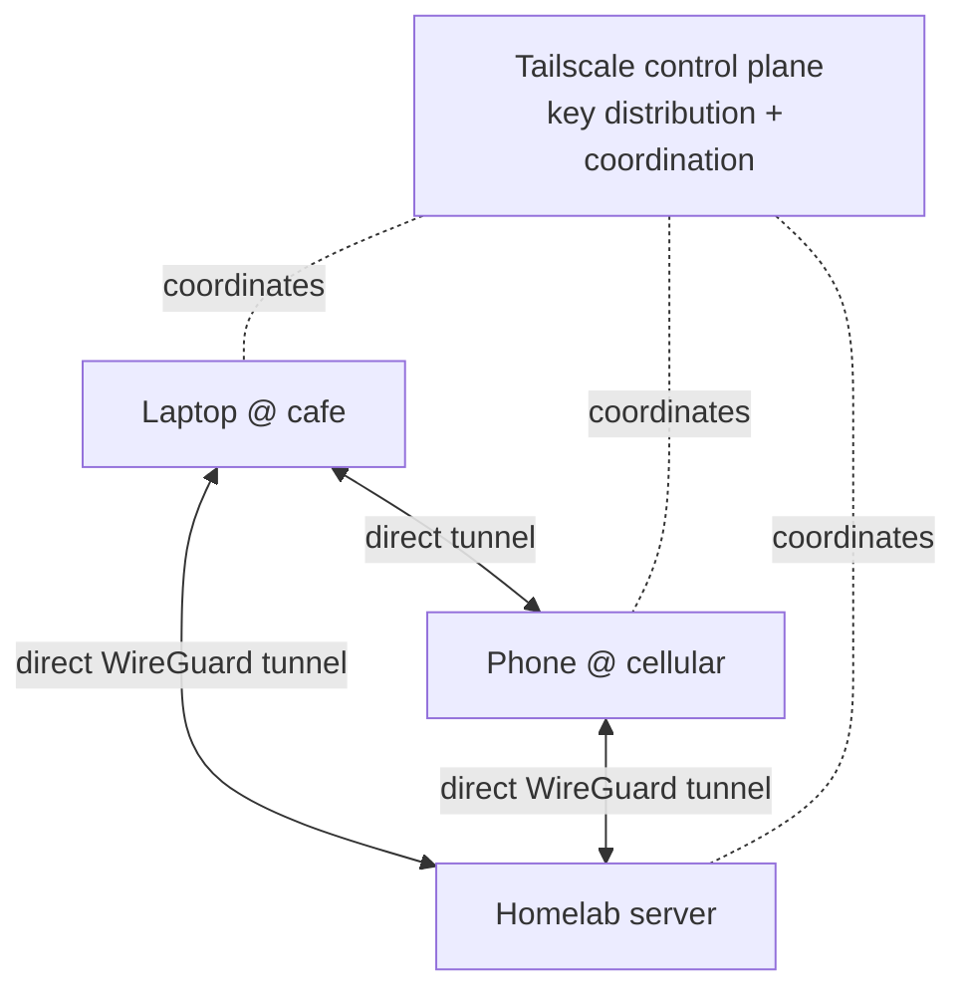

You just hand-configured WireGuard and felt its sharp edges: exchanging public keys by hand,
needing a reachable endpoint (and thus a forwarded UDP port), keeping NAT mappings alive.
**Tailscale** is a service built *on top of* WireGuard that automates every one of those pain
points. The tunnels are still WireGuard — same encryption, same speed — but the key distribution,
NAT traversal, and addressing are handled for you. Because you built the primitive first, you can
now appreciate exactly what Tailscale is doing, rather than treating it as magic.

## What Tailscale adds to WireGuard

Tailscale keeps WireGuard's data plane and adds a **control plane** — a coordination service that
solves the hard parts:

- **Key distribution.** Instead of copying public keys between machines by hand, every device
  authenticates to your account and the control plane distributes the right keys automatically.
  Adding a device is a login, not a config edit.
- **NAT traversal.** This is the big one. Recall from WireGuard that at least one peer needed a
  reachable endpoint — a forwarded port. Tailscale uses clever techniques (STUN-style hole
  punching, and relay servers called **DERP** as a fallback) to connect two devices *both* behind
  NAT, with **no port forwarding at all**. Two laptops on different café networks can talk
  directly. (Tailscale's own [*How NAT traversal works*](https://tailscale.com/blog/how-nat-traversal-works)
  post is a genuinely great networking read once you've felt the problem yourself.)
- **Identity.** Devices are tied to *user identities* (via your existing SSO — Google, GitHub,
  etc.), so access is about *who owns the device*, not just which key it holds. This is the
  foundation of the ACLs below and of the zero-trust model.

The result: you install Tailscale, log in, and your devices form a private mesh network — a
**tailnet** — where each can reach the others directly and securely, wherever they are.



Note the control plane *coordinates* but the actual data tunnels are direct, peer-to-peer
WireGuard — your traffic doesn't route through Tailscale's servers (except as a last-resort DERP
relay when a direct connection truly can't be made).

## Building your tailnet

The setup is deliberately trivial compared to Lesson 5.1 — that's the whole point:

```sh
# On each device (Linux example; there are apps for macOS, Windows, iOS, Android)
curl -fsSL https://tailscale.com/install.sh | sh
sudo tailscale up            # opens a login; authenticate with your SSO
tailscale status             # see all devices in your tailnet and their tailnet IPs
tailscale ip                 # this device's tailnet IP (in the 100.x.y.z range)
```

Install it on your laptop, your phone, and your [Module 2](/modules/02-server/) server. Within
minutes they can all reach each other by their tailnet IPs — from anywhere, no port forwarding,
no key copying. Compare that to the hand-work of Lesson 5.1 and you understand what you're paying
for (in convenience, and in trusting a third-party control plane — a trade-off Lesson 5.4 makes
explicit).

## MagicDNS: names instead of IPs

Tailscale's **MagicDNS** gives every device a stable name, so you reach your server as
`homelab` (or `homelab.your-tailnet.ts.net`) instead of memorizing a `100.x.y.z` address — the
same quality-of-life win as the local DNS names you set up in
[Lesson 3.2](/modules/03-network/services/), but working from anywhere. Enable it in the admin
console; then `ssh homelab` works whether you're at home or abroad.

## ACLs: access policy as code

Here's where Tailscale becomes a *security* tool, not just a convenience. By default every device
in your tailnet can reach every other — fine to start, but the same flat-network problem you
segmented away in [Lesson 3.3](/modules/03-network/segmentation/). **ACLs** (Access Control
Lists) let you write policy — *as code* — controlling who and what can reach what:

```json
{
  "acls": [
    // Your own devices can reach your servers
    { "action": "accept", "src": ["autogroup:member"], "dst": ["tag:server:22,80,443"] },
    // A phone can reach the server's web UI only, nothing else
    { "action": "accept", "src": ["tag:phone"], "dst": ["tag:server:443"] }
  ]
}
```

This is **policy as code** — the same principle as the firewall zones in
[Lesson 3.3](/modules/03-network/segmentation/) and a direct preview of the
Infrastructure-as-Code mindset in [Module 7](/modules/07-automation/): your access policy is a
text file you version in git, review, and apply — not a pile of clicks nobody can audit. Writing
one ACL that restricts a device is a checkpoint item precisely because "I can express access
policy as reviewable code" is a real professional signal.

## Extending the tailnet to your whole LAN

Two features connect the tailnet to the rest of your network:

- **Subnet routers.** A Tailscale node can advertise a route to a whole subnet, so your phone can
  reach *every* device on your home LAN (or a specific VLAN from
  [Lesson 3.3](/modules/03-network/segmentation/)) through that one node — even devices that don't
  run Tailscale themselves (your printer, an IoT device). `sudo tailscale up --advertise-routes=192.168.20.0/24`.
- **Exit nodes.** A node can offer to route *all* of another device's internet traffic (the
  `0.0.0.0/0` full-tunnel idea from WireGuard, made a one-click toggle) — so you can browse "as
  if from home" on untrusted café WiFi.

These map directly onto the raw WireGuard `AllowedIPs` concepts from Lesson 5.1 — subnet routers
are "add the LAN range to AllowedIPs," exit nodes are "`AllowedIPs = 0.0.0.0/0`." Because you
learned the primitive, these features are obvious rather than mysterious.

## Headscale: self-hosting the control plane

Tailscale's one philosophical wrinkle for this curriculum: the **control plane is a third-party
service** (even though your data tunnels are direct). If you want the convenience *and* full
self-hosting — very much this curriculum's ethos — **Headscale** is an open-source, self-hostable
implementation of the Tailscale control server. You run Headscale on a small reachable host (your
server, or a cheap VPS), point your devices at it, and you get tailnet convenience with no
third-party coordinator.

:::note[The self-hosting through-line]
Headscale is optional, and Tailscale's hosted service is genuinely excellent and free for
personal use — start there. But note the pattern: this curriculum keeps offering a self-hosted
alternative to every managed service (your own DNS resolver in Module 3, your own git server in
Module 6, Headscale here) so that you understand the managed version *and* can replace it. Knowing
both "use the easy hosted thing" and "here's how I'd run it myself" is exactly the range employers
value.
:::

## Quick self-check

1. Tailscale uses WireGuard underneath — so what does Tailscale actually *add*?
2. What problem does DERP/NAT traversal solve that raw WireGuard made you handle with a
   forwarded port?
3. Does your traffic normally flow *through* Tailscale's servers? Explain.
4. What is an ACL, and why is "policy as code" a meaningful improvement over default
   allow-everything?
5. How do subnet routers and exit nodes map onto the WireGuard `AllowedIPs` concept from 5.1?
6. What is Headscale, and why might you choose it despite Tailscale's hosted service being free
   and excellent?

**Next:** [Lesson 5.3 · Cloudflare Tunnel →](/modules/05-overlay/cloudflare/)
