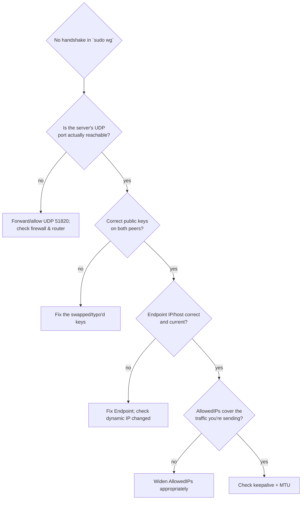

**WireGuard** is a modern VPN: a small, fast, auditable protocol that builds an encrypted tunnel
between machines. It's the foundation the rest of this module builds on — Tailscale *is*
WireGuard with the hard parts automated. So you'll learn it the honest way: by hand-writing the
config, understanding every line, and debugging it when it doesn't connect. Do this, and the
"magic" tools later become tools you understand rather than trust blindly.

## The mental model

WireGuard connects **peers**. Unlike old client/server VPNs, WireGuard is peer-to-peer at its
core: each machine has a **key pair**, knows its own **private key**, and lists the **public
keys** of the peers it will talk to. A tunnel forms between two peers when each has the other's
public key and they can reach each other on the network. Traffic inside the tunnel is encrypted;
to anyone in between it's just opaque UDP.

You already understand the cryptographic foundation from SSH ([Lesson 0.2](/modules/00-toolkit/remote/)):
a **private key** stays secret on the machine, a **public key** is shared with peers, and the
math lets peers authenticate and encrypt to each other without ever sending a secret. WireGuard
uses exactly this idea.

WireGuard also runs over **UDP** (recall [Lesson 1.2](/modules/01-fundamentals/tcpip/)): it's
connectionless and lightweight, with no TCP-style handshake overhead — which is part of why it's
fast, and also why "is the UDP packet even arriving?" is a key debugging question later.

## Generating keys

Install WireGuard, then generate a key pair on each machine:

```sh
sudo apt install wireguard

# Generate a private key, and derive the public key from it
wg genkey | tee privatekey | wg pubkey > publickey
cat privatekey    # keep secret — like an SSH private key
cat publickey     # share with peers — like an SSH public key
```

The same secrecy rules as always ([Lesson 0.4](/modules/00-toolkit/git/)): the **private key
never leaves the machine and never goes in git**; the public key is safe to share.

## A minimal tunnel: laptop ↔ server

Let's connect your laptop to your homelab server. WireGuard configs live in
`/etc/wireguard/` (conventionally `wg0.conf`). Each peer gets an address on a **private overlay
subnet** — a little network that exists only inside the tunnel (e.g. `10.10.0.0/24`), separate
from your LAN.

**On the server** (`/etc/wireguard/wg0.conf`):

```ini
[Interface]
Address = 10.10.0.1/24              # this peer's address on the overlay network
ListenPort = 51820                  # the UDP port WireGuard listens on
PrivateKey = <SERVER_PRIVATE_KEY>

[Peer]                              # the laptop
PublicKey = <LAPTOP_PUBLIC_KEY>
AllowedIPs = 10.10.0.2/32           # which overlay IPs this peer owns (see below!)
```

**On the laptop** (`/etc/wireguard/wg0.conf`):

```ini
[Interface]
Address = 10.10.0.2/24
PrivateKey = <LAPTOP_PRIVATE_KEY>

[Peer]                              # the server
PublicKey = <SERVER_PUBLIC_KEY>
Endpoint = your-home-ip:51820       # where to reach the server (public IP or hostname)
AllowedIPs = 10.10.0.1/32           # just the server's overlay IP, for now
PersistentKeepalive = 25            # keep the NAT mapping alive (see below)
```

Bring the tunnel up (and down) with `wg-quick`:

```sh
sudo wg-quick up wg0        # start the tunnel
sudo wg                     # show tunnel status, peers, handshakes, transfer
sudo wg-quick down wg0      # stop it
```

If it's working, `sudo wg` shows a recent **latest handshake** and, once you ping across,
transferred bytes. From the laptop, `ping 10.10.0.1` now reaches the server *through the
encrypted tunnel*.

## AllowedIPs: the concept everyone gets wrong

`AllowedIPs` is the single most misunderstood part of WireGuard, so slow down here. It does
**two jobs at once**, which is why it confuses people:

1. **Routing (outbound):** "send traffic destined for *these* IPs into the tunnel to this peer."
2. **Filtering (inbound):** "only accept traffic *from* this peer if it's sourced from these IPs."

So `AllowedIPs` is a list of the IP ranges that "belong" to a peer, on both directions. Getting
it wrong is the cause of most "the tunnel is up but traffic doesn't flow" problems:

- Too **narrow**, and traffic you wanted routed through the tunnel isn't — it goes out your
  normal connection instead, or is dropped.
- Too **broad** (like `0.0.0.0/0`), and you're telling WireGuard to route *all* your traffic
  through that peer — which is exactly what you want for a "full VPN" but *not* what you want for
  "just reach my homelab."

:::note[The rule of thumb]
`AllowedIPs` answers "what's reachable *through* this peer?" To reach just the server, list its
overlay IP (`10.10.0.1/32`). To reach your whole home LAN through the server (a "subnet route"),
add your LAN range too (e.g. `10.10.0.1/32, 192.168.20.0/24`). To route *all* internet traffic
through it (full-tunnel VPN, e.g. to appear at home while travelling), use `0.0.0.0/0`. Deciding
this deliberately is most of configuring WireGuard correctly.
:::

## The other pieces that trip people up

Three more settings that cause the majority of real-world WireGuard pain — worth understanding
before you debug them:

- **Endpoint & who can reach whom.** For a handshake, at least **one** peer needs a reachable
  `Endpoint` (a public IP/hostname and open UDP port). Your laptop behind café NAT can't be
  reached directly, but it can *initiate* to the server's endpoint — so the server needs a
  reachable port, which means (ironically) forwarding **one UDP port** (51820) on your home
  router, or running WireGuard on an already-reachable host. Tailscale's whole value proposition
  (next lesson) is making even this unnecessary.
- **PersistentKeepalive.** NAT mappings ([Lesson 1.2](/modules/01-fundamentals/tcpip/)) expire
  when idle. `PersistentKeepalive = 25` sends a tiny packet every 25 seconds so the path stays
  open — essential when a peer is behind NAT and you want the tunnel to stay reachable.
- **MTU.** A tunnel adds overhead, so the effective packet size (**MTU**) inside it is smaller.
  Occasionally this causes weird symptoms — small pings work, but big transfers or web pages hang.
  If you hit that, lowering the interface MTU is the fix. Knowing this exists saves hours.

## Debugging a handshake methodically

When a tunnel won't come up, resist the urge to randomly change settings. Work it like the
[Lesson 2.4](/modules/02-server/operating/) method — layer by layer, one change at a time:



Concretely, the checks:

```sh
sudo wg                          # is there a "latest handshake"? any transfer? which direction?
sudo wg-quick down wg0 && sudo wg-quick up wg0    # reload after a config edit
sudo tcpdump -i any udp port 51820 -n            # (Module 1.5!) is the UDP even arriving?
ping 10.10.0.1                    # test the overlay, not the internet
```

That `tcpdump` line is the payoff of [Lesson 1.5](/modules/01-fundamentals/capture/) and
[Module 3](/modules/03-network/): when a handshake fails, capturing on UDP 51820 answers the
single most important question — *are the packets even arriving?* If they're not, it's a
reachability/firewall problem (lower layer); if they are but no handshake completes, it's keys or
config. Deliberately breaking and diagnosing this is [Lab 2](/modules/05-overlay/labs/#lab-2--break-it-on-purpose),
and the flowchart above is the diagnostic tree you'll build for real.

## What you now understand

You can hand-write a WireGuard config, explain what every line does — especially `AllowedIPs` —
and debug a failed handshake methodically instead of by trial and error. That understanding is
the foundation for everything else in this module: Tailscale and Headscale are WireGuard with the
key exchange and NAT traversal automated, and you now know exactly what they're automating and
why it's hard.

## Quick self-check

1. What does each peer need to know about the peers it talks to, and what stays secret?
2. Explain the *two* jobs `AllowedIPs` does. What goes wrong if it's too narrow? Too broad?
3. What `AllowedIPs` value turns WireGuard into a full-tunnel "route everything" VPN?
4. Why does at least one peer need a reachable `Endpoint`, and what does that imply for a
   home server behind NAT?
5. What does `PersistentKeepalive` fix, and why is it needed behind NAT?
6. A handshake won't complete. What single `tcpdump` command tells you whether it's a
   reachability problem or a config problem?

**Next:** [Lesson 5.2 · Tailscale →](/modules/05-overlay/tailscale/)
