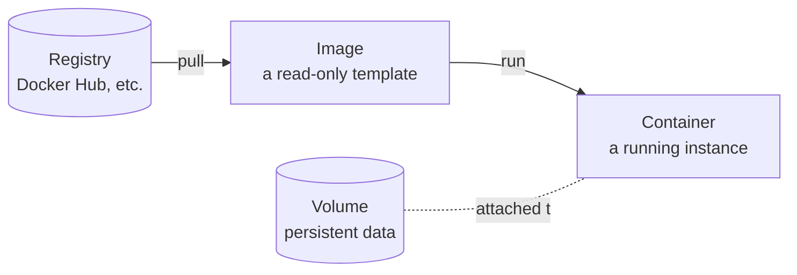

Modern self-hosting runs on **containers**, and the everyday tool is **Docker**. You met the
concept in [Lesson 4.4](/modules/04-storage/virtualization/) — containers share the host kernel
and package an app with its dependencies, lighter than a full VM. Now you'll actually use them:
run services as containers, persist their data, and — the part that matters most for this
curriculum — declare an entire multi-service stack in a single text file you commit to git. That
last idea is the bridge from "I installed some software" to "my infrastructure is code."

## Why containers changed operations

Before containers, installing a service meant wrestling its dependencies onto your specific OS,
hoping nothing conflicted with another service, and dreading the upgrade. Containers fixed this
by packaging an application *with everything it needs to run* into a portable, isolated unit:

- **Reproducible** — the same container runs identically on your laptop, your server, and the
  cloud. "Works on my machine" stops being a problem, because the machine comes *with* the app.
- **Isolated** — each service runs in its own container with its own dependencies; two services
  needing different versions of the same library no longer conflict.
- **Disposable** — you can destroy and recreate a container in seconds, which (as you'll see)
  changes how fearlessly you operate.

## The mental model: images, containers, volumes

Three concepts unlock Docker:



- An **image** is a read-only template — a packaged application and its dependencies (e.g. the
  official `nginx` image, or `forgejo`). You **pull** images from a **registry** (Docker Hub is
  the default public one).
- A **container** is a running instance of an image — like a process ([Lesson 1.1](/modules/01-fundamentals/machine/))
  is a running instance of a program. You can run many containers from one image.
- A **volume** is persistent storage attached to a container. This is the crucial one (below):
  containers are disposable, but your *data* must not be.

## The critical distinction: ephemeral vs. persistent

Here's the concept that, misunderstood, causes new self-hosters to lose data — connecting
straight back to [Module 4](/modules/04-storage/):

**A container's own filesystem is ephemeral.** Destroy and recreate the container (to upgrade it,
say) and anything written inside it is *gone*. That's by design — it's what makes containers
disposable and reproducible. So anything that must survive — a database, uploaded files, your git
repositories — must live in a **volume** mounted into the container, not in the container itself.

:::danger[Data in the container is data you will lose]
The classic self-hosting disaster: run a database in a container without a volume, upgrade the
container months later, and every record vanishes — because the container's filesystem was
ephemeral all along. **Persistent data goes in named volumes (or bind-mounted host directories),
never in the container's own layer.** And those volumes are exactly what your
[Lesson 4.3](/modules/04-storage/backups/) restic backups must target — the container is
reproducible from its image; the volume is the irreplaceable part. This is the "cattle, not pets"
idea made concrete: the container is cattle, the volume is the data you protect.
:::

## Basic Docker commands

Install Docker (on your server, or a VM on your Proxmox host from Module 4), then:

```sh
docker run -d --name web -p 8080:80 nginx    # run nginx detached, mapping host:8080 -> container:80
docker ps                                     # list running containers (like `ps`, Lesson 1.1)
docker ps -a                                  # include stopped ones
docker logs web                               # a container's logs (like journalctl -u, Lesson 2.2)
docker logs -f web                            # follow them live
docker exec -it web sh                         # get a shell inside a running container
docker stop web && docker rm web              # stop and remove it
docker images                                  # local images
docker pull forgejo/forgejo                    # fetch an image without running it
```

Notice how much transfers from earlier modules: `docker ps` is `ps`, `docker logs` is
`journalctl`, port mapping (`-p 8080:80`) is the ports-and-sockets idea from
[Lesson 1.2](/modules/01-fundamentals/tcpip/). Containers aren't a new world — they're the
Linux fundamentals you already have, packaged.

## Docker Compose: your stack as a file

Running containers with long `docker run` commands doesn't scale past a couple of services, and —
worse — it isn't *reproducible* or *version-controlled*. **Docker Compose** fixes this: you
declare your whole stack in a single YAML file (`compose.yaml`), and bring it up or down with one
command.

```yaml
# compose.yaml — a service declared as code
services:
  blog:
    image: ghost:5
    restart: unless-stopped
    ports:
      - "8080:2368"
    volumes:
      - blog-data:/var/lib/ghost/content   # persistent data survives container recreation
    environment:
      - url=https://blog.example.com

volumes:
  blog-data:                                # a named volume, managed by Docker
```

```sh
docker compose up -d        # create and start everything in the file, detached
docker compose ps           # status of this stack
docker compose logs -f      # follow all services' logs
docker compose down         # stop and remove the containers (volumes persist!)
docker compose pull && docker compose up -d   # upgrade: pull new images, recreate containers
```

Two things about this file make it the heart of the module:

- **It's declarative.** You describe the *desired state* — which images, which ports, which
  volumes, which settings — and Compose makes reality match it. This is the same mindset as the
  Infrastructure-as-Code you'll formalize in [Module 7](/modules/07-automation/) with Ansible.
- **It goes in git.** The `compose.yaml` is text, so it's committed, diffed, and reviewed like
  any code ([Module 0](/modules/00-toolkit/git/)). Your services become reproducible: destroy the
  container, `docker compose up -d`, and it's back exactly as specified — with its data intact in
  the volume.

:::caution[Secrets don't go in the Compose file you commit]
Compose files often need passwords or API keys (a database password, an admin token). Those are
secrets ([Lesson 0.4](/modules/00-toolkit/git/)) — **do not commit them.** Use a `.env` file
(gitignored) that Compose reads, or Docker secrets, and commit a `.env.example` with placeholders.
[Module 7](/modules/07-automation/) formalizes this with `sops`/age. The pattern is exactly the
`config.example` one from earlier modules.
:::

## Why this is the foundation for everything that follows

Every service in the rest of this module — the reverse proxy, your blog, your git server, the
supporting apps — is deployed as a container declared in a Compose file. By the end you'll have a
small repository of Compose files that *is* your homelab's service layer: reproducible, backed up
(the volumes), and version-controlled. That repository, plus the Ansible from
[Module 7](/modules/07-automation/), is what lets you rebuild your entire homelab from code — the
payoff this whole curriculum drives toward.

## Quick self-check

1. Explain image vs. container vs. volume in your own words.
2. Why is a container's own filesystem ephemeral, and what's the consequence for a database?
3. Where must persistent data live, and how does that connect to your Module 4 backups?
4. What does it mean that a Compose file is "declarative," and why does that matter?
5. Why does keeping `compose.yaml` in git make your services reproducible?
6. Where do secrets go, if not in the committed Compose file?

**Next:** [Lesson 6.2 · The Reverse Proxy →](/modules/06-selfhosting/reverse-proxy/)
