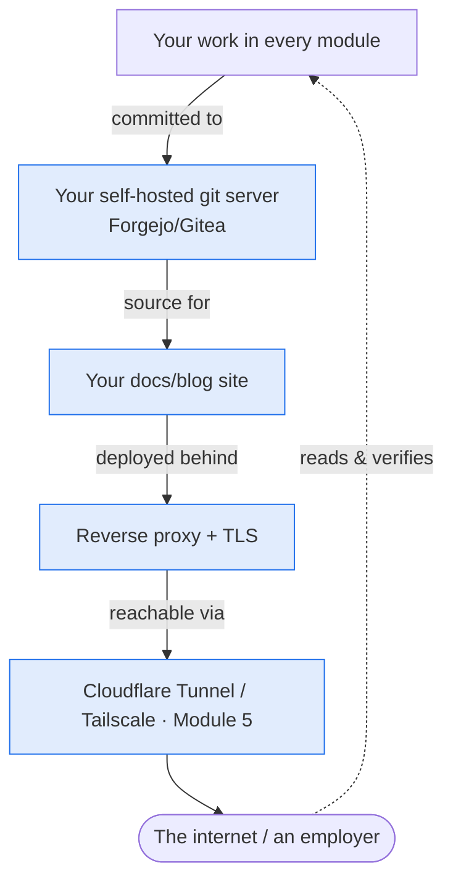

Now everything converges. You have a hardened server ([Module 2](/modules/02-server/)), a
segmented network ([Module 3](/modules/03-network/)), tested backups and a hypervisor
([Module 4](/modules/04-storage/)), and secure remote access ([Module 5](/modules/05-overlay/)).
This module turns that foundation into *running services* — and, crucially, the two that make
this curriculum's signature real: **your own blog and your own git server, hosted on your own
hardware, reachable from the internet through the tunnels you built.**

From here on, your portfolio lives on infrastructure you built and secured. When an employer
visits your site, the fact that the page loads at all *is* your résumé.

## The closed loop, completed

This is the module where the curriculum's central idea becomes literal:

Your homelab hosts your portfolio; your portfolio documents your homelab. That loop — the work
and its proof in one self-hosted place — is this curriculum's signature, and Module 6 is where
it closes.

## What you need

- Your Proxmox host from [Module 4](/modules/04-storage/) (or the bare Module 2 server), on your
  network with backups running.
- A **domain** (the ~$10/yr from the [hardware guide](/guides/hardware/)) — needed for real TLS
  and for publishing.
- The overlay access from [Module 5](/modules/05-overlay/) (Cloudflare Tunnel for public
  publishing, Tailscale for private services).

## The lessons

| Lesson | Topic | Time |
|---|---|---|
| [6.1 · Docker & Compose](/modules/06-selfhosting/docker/) | Images, containers, volumes, and declarative stacks | 5–7 hrs |
| [6.2 · The Reverse Proxy](/modules/06-selfhosting/reverse-proxy/) | One front door for many services | 4–5 hrs |
| [6.3 · TLS Certificates You Own](/modules/06-selfhosting/tls/) | Let's Encrypt, ACME, and the DNS-01 challenge | 3–5 hrs |
| [6.4 · The Services That Close the Loop](/modules/06-selfhosting/services/) | Your blog, your git server, and the supporting cast | 5–7 hrs |
| [Labs](/modules/06-selfhosting/labs/) | The five graded exercises | 8–12 hrs |

Total: roughly **30–40 hours**, or 3–4 weeks part-time.

## Checkpoint

- [ ] I deploy services declaratively with Compose files kept in git
- [ ] All my services sit behind one reverse proxy with valid TLS
- [ ] I can obtain and auto-renew certificates, including via DNS-01
- [ ] My blog is live at a real domain on my own hardware
- [ ] My code lives on a git server I host myself
- [ ] Every service is backed up and reachable through my overlay network

## Deliverable

**Your live, self-hosted portfolio site and git server** — publicly reachable, TLS-valid,
hosting all your writeups to date. This *is* the closed loop. Submit the URL to the
[showcase](/guides/showcase/). Full spec in
[Lab 5](/modules/06-selfhosting/labs/#lab-5--publish-the-portfolio).

## Resources

- [Awesome-Selfhosted](https://awesome-selfhosted.net/) — the catalog of what you can run
- [Docker docs](https://docs.docker.com/) and [Compose docs](https://docs.docker.com/compose/)
- [Caddy documentation](https://caddyserver.com/docs/) — automatic HTTPS that feels like magic
- [Forgejo](https://forgejo.org/) / [Gitea](https://docs.gitea.com/) — self-hosted git
- r/selfhosted — a large, friendly community for the 2am moments
