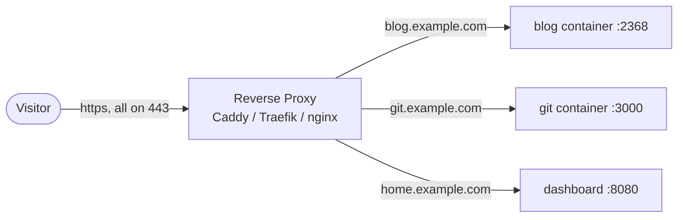
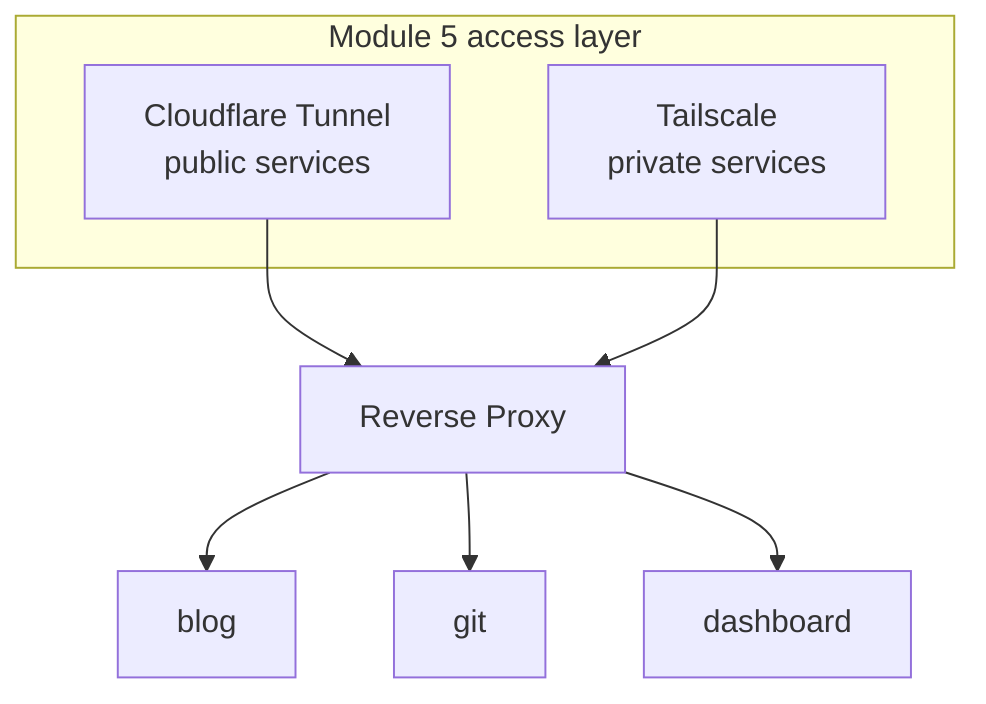

You're about to run several services — a blog, a git server, a dashboard. Each listens on some
port. You do *not* want to expose a pile of random ports and tell people "the blog is on :8080,
git is on :3000." Instead you put one **reverse proxy** in front of everything: a single entry
point that receives all incoming web requests and routes each to the right service based on the
hostname requested. This is how essentially every real web deployment is structured, and the
same pattern you'll meet in the cloud as a "load balancer" or "ingress."

## What a reverse proxy does

A **reverse proxy** sits in front of your services and forwards client requests to them:



Every visitor connects to the proxy on the standard web ports (80/443). The proxy looks at the
**hostname** in the request (`blog.example.com` vs. `git.example.com` — the `Host:` header from
[Lesson 1.4](/modules/01-fundamentals/http-tls/)) and forwards it to the correct backend service.
The services themselves don't need to be exposed at all; only the proxy is reachable.

It solves several problems at once:

- **One entry point** — all traffic arrives at 80/443; no zoo of ports.
- **Virtual hosting** — many services behind one IP, distinguished by hostname.
- **TLS termination** — the proxy handles HTTPS/certificates ([Lesson 6.3](/modules/06-selfhosting/tls/))
  centrally, so each backend service doesn't have to.
- **A single choke point** for logging, rate limits, and access rules.

## Virtual hosts: many services, one IP

The magic that makes "many sites, one server" work is **name-based virtual hosting**. Recall from
[Lesson 1.4](/modules/01-fundamentals/http-tls/) that every HTTP request carries a `Host:` header
saying which site it wants. The reverse proxy reads that header and routes accordingly. So
`blog.example.com` and `git.example.com` can both resolve to your one public entry point (via DNS
from [Lesson 1.3](/modules/01-fundamentals/dns/)), and the proxy sends each to the right container.

This is the same mechanism, at small scale, that lets a single cloud load balancer serve dozens
of services — which is exactly why learning it here demystifies that later.

## Choosing a proxy

Three common choices, each with a teaching angle:

| Proxy | Why you'd pick it |
|---|---|
| **Caddy** | **Automatic HTTPS** out of the box — it obtains and renews Let's Encrypt certificates for you with near-zero config. The friendliest starting point, and what this curriculum leans toward. |
| **Traefik** | **Label-driven** — it auto-discovers Docker containers via labels in your Compose file, so services configure their own routing. Powerful for dynamic container setups. |
| **nginx** | The classic, ubiquitous, manual option. More configuration, but you'll meet it everywhere, and configuring it by hand teaches you what the others automate. |

The recommendation: start with **Caddy** because automatic HTTPS removes the single most annoying
part of self-hosting. A minimal Caddy config for two services is genuinely this short:

```
# Caddyfile — Caddy obtains and renews TLS automatically for these names
blog.example.com {
    reverse_proxy blog:2368
}

git.example.com {
    reverse_proxy git:3000
}
```

That's it. Caddy sees those hostnames, fetches valid Let's Encrypt certificates for them
([Lesson 6.3](/modules/06-selfhosting/tls/)), and routes each to the named container. Run Caddy
itself as a container in your Compose stack, on the same Docker network as the services, and the
names (`blog`, `git`) resolve to the containers automatically.

## Where the proxy sits in your architecture

The reverse proxy is the hinge between your [Module 5](/modules/05-overlay/) access layer and your
services:



- **Public services** (your blog) arrive via the Cloudflare Tunnel, which points at your reverse
  proxy, which routes to the blog container.
- **Private services** (an admin dashboard) you reach over Tailscale, hitting the same proxy from
  inside your tailnet.

One proxy, fed by your two access methods, fronting all your services — clean, and exactly how a
professional would lay it out. Note a subtlety with Cloudflare Tunnel: it already terminates TLS
at Cloudflare's edge ([Lesson 5.3](/modules/05-overlay/cloudflare/)), so for purely
Cloudflare-fronted services the proxy's own TLS matters less; for Tailscale-reached and
directly-reached services, the proxy's TLS ([Lesson 6.3](/modules/06-selfhosting/tls/)) is what
gives you the padlock. You'll sort out which services get certificates from where — a real
architecture decision worth an ADR note ([Lesson 5.4](/modules/05-overlay/choosing/)).

## The cloud parallel (worth holding onto)

Everything a reverse proxy does, a cloud **load balancer** or Kubernetes **ingress** also does:
one public entry point, routing to backends by hostname/path, terminating TLS, applying rules.
When you get to [Module 9](/modules/09-career/) and map your homelab to cloud services, "my
reverse proxy → their load balancer / ingress" is one of the cleanest translations. You're
learning the primitive that the managed services are built on — which means you'll understand
those services instead of just clicking through their wizards.

## Quick self-check

1. What problem does a reverse proxy solve, and what does a visitor actually connect to?
2. How does the proxy know which backend service a request is for?
3. Why don't your backend services need to be individually exposed to the internet?
4. Why is Caddy a friendly first choice for a homelab reverse proxy?
5. How do your Module 5 access methods (Cloudflare Tunnel, Tailscale) relate to the reverse proxy?
6. What cloud service is the reverse proxy the small-scale equivalent of?

**Next:** [Lesson 6.3 · TLS Certificates You Own →](/modules/06-selfhosting/tls/)
