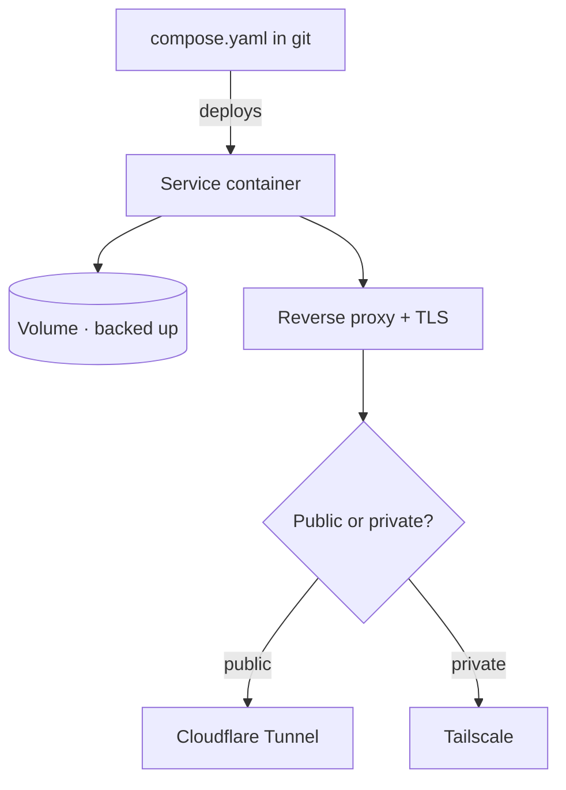

Everything so far in this module — containers, the reverse proxy, TLS — has been infrastructure.
This lesson is what you build *on* it: the actual services that make your homelab useful and,
above all, the two that **close this curriculum's loop** — your own **blog/docs site** and your
own **git server**. When these run on hardware you built, secured, and can reach from anywhere,
your portfolio and the infrastructure it describes become the same thing.

## The pattern every service follows

By now you have a repeatable recipe. *Every* service you self-host, from here on, follows the same
five-point pattern — internalize it and adding a new service becomes routine:

1. **Declared in a Compose file** ([Lesson 6.1](/modules/06-selfhosting/docker/)) kept in git.
2. **Data in a volume** ([Lesson 6.1](/modules/06-selfhosting/docker/)) — never in the container.
3. **Behind the reverse proxy** ([Lesson 6.2](/modules/06-selfhosting/reverse-proxy/)) with a
   hostname.
4. **With valid TLS** ([Lesson 6.3](/modules/06-selfhosting/tls/)).
5. **Backed up** (the volume, via [Lesson 4.3](/modules/04-storage/backups/)) and **reachable via
   your overlay** ([Module 5](/modules/05-overlay/)) — publicly (Cloudflare Tunnel) or privately
   (Tailscale) as appropriate.

## The two services that close the loop

### Your blog / docs site

This is where every writeup you've produced — the [packet-capture walkthrough](/modules/01-fundamentals/labs/),
the [server build log](/modules/02-server/labs/), the [network diagram](/modules/03-network/labs/),
the [restore demo](/modules/04-storage/labs/), the [remote-access ADR](/modules/05-overlay/labs/) —
comes to live *publicly*. Options, all self-hostable:

- **A static site generator** — Hugo, Astro (like *this very site*), or similar. You write in
  Markdown ([Lesson 0.5](/modules/00-toolkit/writing/)), it builds to static HTML, you serve it.
  Fast, secure (nothing dynamic to attack), and it plays perfectly with the CI/CD you'll add in
  [Module 7](/modules/07-automation/).
- **Ghost** — a full blogging platform (database-backed) if you want a rich editor and prefer a
  CMS to writing Markdown files.

Publish it via **Cloudflare Tunnel** ([Lesson 5.3](/modules/05-overlay/cloudflare/)) so the world
can reach it with no open ports. This is the "deliverable" of the whole curriculum's documentation
thread — the public face an employer will actually visit.

### Your git server

Time to move your repositories off GitHub and onto hardware you own — a satisfying milestone the
curriculum has pointed at since [Lesson 0.4](/modules/00-toolkit/git/). The self-hosted git
servers:

- **Forgejo** (a community-run fork of Gitea) or **Gitea** — lightweight, single-binary/container
  git servers with a GitHub-like web UI, issues, pull requests, and — importantly for
  [Module 7](/modules/07-automation/) — **built-in CI/CD actions**.

Stand one up, then migrate your curriculum repo to it and push a commit to *your own* git server.
You can keep a GitHub mirror if you like (useful for the public showcase and as an offsite copy —
[3-2-1](/modules/04-storage/backups/)), but the primary now lives on your infrastructure.

:::note[Why this is the closed loop, made literal]
Look at what you've just built: your **code** lives on a git server *you host*; your **site** is
built from that code and documents the very infrastructure it runs on; it's served through a
**reverse proxy** and **tunnel** *you configured*, on a **server** *you hardened*, on a **network**
*you segmented*, backed by **backups** *you tested*. Every layer is yours. When the page loads for
a stranger, it is simultaneously your portfolio *and* live proof that all of it works. That is the
signature of this curriculum, and you have now literally closed it.
:::

## The supporting cast (optional but motivating)

Once the pattern is muscle memory, adding services is fast and genuinely fun — this is where
self-hosting becomes a rewarding habit. A few high-value ones, each following the five-point
pattern above:

- **A dashboard** (Homepage, Homer) — one page linking all your services, a friendly front door
  to your homelab.
- **A password manager** (Vaultwarden — a lightweight Bitwarden-compatible server) — genuinely
  useful, and it puts the [Lesson 0.4](/modules/00-toolkit/git/)/[Module 8](/modules/08-security/)
  "manage your secrets properly" lesson into daily practice. (Back this one up especially well.)
- **RSS / read-it-later** (FreshRSS, Wallabag), **bookmarks** (Linkding), **file sync**
  (Nextcloud) — whatever scratches a real itch for you.

The [Awesome-Selfhosted](https://awesome-selfhosted.net/) catalog is the map of what's possible;
you now have the skills to run any of it.

:::tip[Restraint is a skill too]
It's tempting to deploy twenty services in a weekend. Resist a little: every service you run is
something to **update, back up, and secure** ([Module 8](/modules/08-security/)) — it's a small
ongoing responsibility, not just a one-time install. Run what you'll actually use and maintain.
"I run a handful of services well" beats "I ran thirty and half are broken and unpatched" — and
that judgment about operational burden is itself a professional trait worth demonstrating.
:::

## Everything is now Infrastructure-as-Code-ready

Step back and notice the shape of what you have: a directory of **Compose files** describing every
service, their **volumes** targeted by backups, all behind a **proxy config**, reachable through
your **overlay** — and all of it text in git. This is the launchpad for
[Module 7](/modules/07-automation/), where **Ansible** will orchestrate deploying this entire
stack from code, and **CI/CD** will redeploy your site automatically when you push. You've built
the services by hand so you understand them; next you'll automate them so you never have to do it
by hand again — the exact arc this curriculum keeps repeating, because it's the arc of the
profession.

## Quick self-check

1. State the five-point pattern every self-hosted service in your homelab follows.
2. Which two services "close the loop," and what makes that loop closed?
3. Why is a static site generator a natural fit for your blog, especially with Module 7 coming?
4. Why migrate your repos to a self-hosted git server, and why might you keep a GitHub mirror?
5. Why is restraint about how many services you run a professional skill, not just a preference?
6. How does the state of your homelab at the end of this module set up Module 7?

**Next:** [The Labs →](/modules/06-selfhosting/labs/) — where you deploy the stack, get real TLS,
self-host your git, and publish your portfolio.
