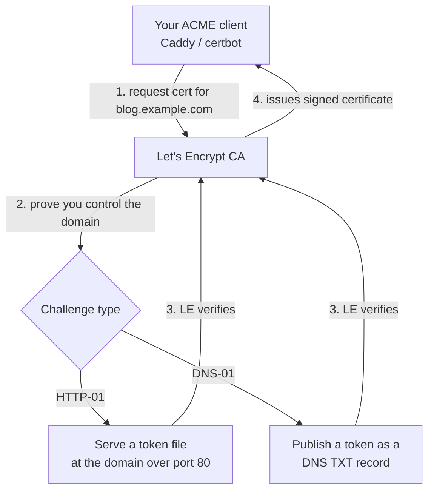

Back in [Lesson 1.4](/modules/01-fundamentals/http-tls/) you learned what a TLS certificate *is*
and what it proves. Now you'll *get* them — real, browser-trusted certificates for your own
services, for free, renewing automatically. This used to be a paid, manual chore that made people
skip HTTPS; **Let's Encrypt** and the **ACME** protocol turned it into a solved, automatable
problem. Understanding how — especially the **DNS-01 challenge** — is a genuinely useful skill,
because certificate problems are a routine part of running services and most people find them
mysterious.

## The problem certificates solve, recapped

From [Lesson 1.4](/modules/01-fundamentals/http-tls/): a certificate lets a visitor's browser
verify it's really talking to your domain and sets up encryption. It's signed by a **Certificate
Authority (CA)** that browsers already trust. The historical friction: getting a CA to sign a
certificate for your domain cost money and involved manual steps, repeated every year at renewal.
So lots of homelabbers ran plain HTTP, or used self-signed certificates that throw scary browser
warnings.

## Let's Encrypt + ACME: free, automatic, trusted

**Let's Encrypt** is a free, automated CA that browsers trust. It issues certificates via
**ACME** (Automatic Certificate Management Environment) — a protocol that lets software request,
prove, obtain, and renew certificates with no human involved. The catch Let's Encrypt has to
solve: before signing a certificate for `blog.example.com`, it must verify *you actually control
that domain*. It does this with a **challenge**.



## The two challenge types — and why DNS-01 fits a homelab

There are two ways to prove domain control, and the difference matters a lot for a homelab behind
NAT and overlay networks:

### HTTP-01

Let's Encrypt gives your ACME client a token; the client serves it at
`http://blog.example.com/.well-known/...` on **port 80**; Let's Encrypt fetches it to confirm
control. Simple and common — but it **requires inbound port 80 to be reachable from the
internet**. That's a problem for exactly the setup you built in [Module 5](/modules/05-overlay/),
where the whole point was *zero open inbound ports*.

### DNS-01 — the elegant homelab answer

Let's Encrypt gives your client a token; the client publishes it as a **DNS TXT record**
(`_acme-challenge.blog.example.com`) using your DNS provider's API; Let's Encrypt checks the DNS
record. Because verification happens over **DNS, not an inbound connection**, DNS-01:

- **Needs no open inbound ports** — perfect for a homelab reachable only via tunnels
  ([Module 5](/modules/05-overlay/)).
- **Can issue wildcard certificates** (`*.example.com`) — one certificate covering all your
  subdomains, which HTTP-01 can't do.

:::note[This is why Lesson 1.3 and Lesson 6.3 connect]
DNS-01 is a direct payoff of understanding DNS ([Lesson 1.3](/modules/01-fundamentals/dns/)) and
records ([the TXT record type](/modules/01-fundamentals/dns/)). Proving domain control by
publishing a TXT record — rather than by opening a port — is the elegant option precisely because
it fits the no-open-ports architecture you built. When people say "just use DNS-01 for your
homelab certs," this is why, and now you understand it rather than cargo-culting it.
:::

## In practice: your proxy does it for you

The good news: you rarely run ACME by hand. Your reverse proxy from
[Lesson 6.2](/modules/06-selfhosting/reverse-proxy/) handles it:

- **Caddy** obtains and renews certificates **automatically** the moment you name a host in the
  Caddyfile — HTTP-01 by default, or DNS-01 with a DNS-provider plugin and API credentials. For
  most homelabbers this is genuinely zero-effort HTTPS.
- **Traefik** does the same, configured via labels/config.
- **certbot** is the standalone ACME client if you're not using an auto-HTTPS proxy (e.g. with
  plain nginx).

To use DNS-01, you give the client an **API token** for your DNS provider (Cloudflare, etc.) so
it can create the TXT records. That token is a secret ([Lesson 0.4](/modules/00-toolkit/git/)) —
scope it as narrowly as your provider allows (DNS-edit only), and keep it out of git.

## Auto-renewal, and what breaks when it fails

Let's Encrypt certificates are **short-lived** (90 days) by design — which *forces* automation,
because nobody renews manually every 90 days reliably. Your proxy renews them well before expiry,
automatically. This is the intended, healthy state.

But renewal *can* fail — the DNS API token expired, the provider changed, a config broke — and a
failed renewal means, 90 days later, an **expired certificate**, which throws a browser error and
takes your site down. This is a classic real-world incident, and it ties two threads together:

:::caution[Expiring certificates are a monitoring problem]
A silently failed renewal is invisible until the certificate expires and users hit a security
warning. This is exactly the kind of thing your [Module 8](/modules/08-security/) monitoring
should *alert* on — "certificate expires in 14 days and hasn't renewed." Recall from
[Lesson 1.3](/modules/01-fundamentals/dns/) that cert issuance now often depends on DNS, so a DNS
problem can become a cert problem can become an outage. Automate renewal, *and* monitor expiry.
Knowing this chain — and building the alert for it — is what separates someone who "set up HTTPS
once" from someone who *operates* it.
:::

## Verify your certificate

Once your proxy has a certificate, confirm it with the tools from
[Lesson 1.4](/modules/01-fundamentals/http-tls/):

```sh
curl -vI https://blog.example.com                    # see the TLS handshake and cert in the output
openssl s_client -connect blog.example.com:443 | openssl x509 -noout -dates   # issued/expiry dates
```

Look for a valid chain to a trusted CA and a sensible expiry date. Then load it in a browser and
see the padlock — recalling ([Lesson 1.4](/modules/01-fundamentals/http-tls/)) that the padlock
means *encrypted and verified as this domain*, which for your own honestly-run service is exactly
what you want it to mean.

## Quick self-check

1. What problem did Let's Encrypt + ACME solve that made HTTPS rare on homelabs before?
2. What does an ACME challenge prove, and why does the CA require it?
3. What's the difference between HTTP-01 and DNS-01, and why does DNS-01 fit a no-open-ports
   homelab better?
4. What can DNS-01 do that HTTP-01 can't?
5. Why are Let's Encrypt certificates deliberately short-lived, and what does that force?
6. Why is certificate expiry a monitoring concern, and which later module builds the alert?

**Next:** [Lesson 6.4 · The Services That Close the Loop →](/modules/06-selfhosting/services/)
