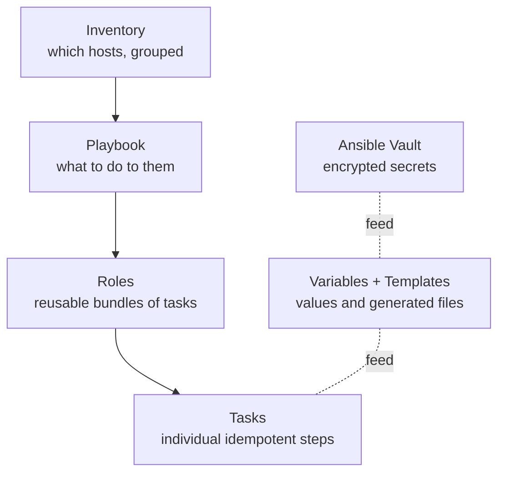

This is the module's signature lesson, and the exercise inside it is the one that teaches the
DevOps mindset better than any lecture: **re-provision the server you hand-built in
[Module 2](/modules/02-server/) — hardening and all — entirely from an Ansible playbook.** You
built it by hand to understand it. Now you encode that understanding as code, so you never do it
by hand again, and so you can rebuild it, identically, forever. That is Infrastructure as Code,
and Ansible is how you'll do it.

## Declarative beats imperative

There are two ways to tell a computer to set up a server:

- **Imperative** — a list of *steps*: "install nginx, then create this file, then start the
  service." This is what a shell script does. The problem: it assumes a starting state. Run it on
  an already-configured box and it may error or duplicate work (the idempotency problem from
  [Lesson 7.1](/modules/07-automation/scripting/)).
- **Declarative** — a description of the desired *end state*: "nginx is installed; this file has
  these contents; the service is running." You don't say *how*; the tool figures out what to
  change to make reality match. Run it against any starting state and it converges to the same
  result.

Ansible is declarative. You describe *what should be true*, and Ansible makes it true —
idempotently, by construction. This is [Lesson 7.1](/modules/07-automation/scripting/)'s "check
the desired state, only act if reality doesn't match" idea, built into every operation, so you
don't hand-write the safety logic.

## Why Ansible specifically

Ansible is a great first IaC tool for a homelab because:

- **Agentless.** It configures servers over plain SSH ([Lesson 0.2](/modules/00-toolkit/remote/)) —
  no software to install on the targets first. If you can SSH to it, Ansible can configure it.
- **Readable.** Playbooks are YAML — human-readable, and they double as documentation of exactly
  how your server is set up.
- **Idempotent modules.** Its building blocks (install a package, template a file, manage a
  service) are idempotent, so running a playbook repeatedly is safe and normal.

## The pieces

Ansible has a small vocabulary. Learn these five and you can read and write real playbooks:



- **Inventory** — a file listing the hosts you manage, in groups (`[servers]`, `[proxmox]`).
- **Playbook** — a YAML file describing tasks to apply to hosts. The top-level unit you run.
- **Tasks** — individual steps, each using a **module** (`apt`, `copy`, `template`, `service`,
  `user`, `ufw`...). Each is declarative and idempotent.
- **Roles** — reusable, shareable bundles of tasks/templates/variables (e.g. a `hardening` role,
  an `nginx` role). How you keep playbooks organized and DRY.
- **Variables & templates** — values (per-host or global) and Jinja2-templated files, so one role
  configures many hosts differently. **Vault** encrypts secret variables (next lesson).

## A playbook you can read

Here's a fragment that encodes part of your Module 2 work — notice how it reads almost like the
hardening checklist from [Lesson 2.3](/modules/02-server/hardening/), but as executable code:

```yaml
# playbook.yml — describe the desired state of a server
- hosts: servers
  become: true                      # use sudo (Lesson 2.2)
  tasks:
    - name: Ensure system packages are current
      apt:
        update_cache: true
        upgrade: dist

    - name: Ensure admin user exists
      user:
        name: alice
        groups: sudo
        append: true                # like usermod -aG (Lesson 2.2)

    - name: Install our baseline tools
      apt:
        name: [htop, ufw, fail2ban, unattended-upgrades]
        state: present

    - name: Harden SSH — no password auth, no root login
      lineinfile:
        path: /etc/ssh/sshd_config
        regexp: "{{ item.re }}"
        line: "{{ item.line }}"
      loop:
        - { re: '^#?PasswordAuthentication', line: 'PasswordAuthentication no' }
        - { re: '^#?PermitRootLogin',        line: 'PermitRootLogin no' }
      notify: restart ssh

    - name: Firewall default-deny, allow SSH
      community.general.ufw:
        rule: allow
        name: OpenSSH

  handlers:
    - name: restart ssh
      service: { name: ssh, state: restarted }
```

Run it with:

```sh
ansible-playbook -i inventory playbook.yml           # apply it
ansible-playbook -i inventory playbook.yml --check    # DRY RUN — show what WOULD change
```

Read what each task *says*: "ensure the admin user exists," "harden SSH." It's declarative —
you're describing the destination, not the route. And every task is idempotent: run this playbook
against a fresh VM and it configures everything; run it again and it reports **"ok"** for
everything already correct, changing nothing. That green "ok, changed=0" on a second run is
idempotency you can *see*.

:::tip[`--check` is your safety net]
`ansible-playbook --check` does a dry run: it reports what *would* change without changing
anything. Run it before applying to a real server, every time — it's the automation equivalent of
"look before you leap," and it catches mistakes while they're still harmless. This is the same
caution as `mount -a` before reboot ([Lesson 4.1](/modules/04-storage/disks/)) or Ansible's
cousin of "measure twice, cut once."
:::

## The signature exercise: your server, as code

Here's the exercise that makes it click ([Lab 2](/modules/07-automation/labs/#lab-2--server-as-code)):
take the **entire Module 2 build** — the install-time setup, the users, the packages, the full
[hardening checklist](/modules/02-server/hardening/) — and express it as an Ansible playbook.
Then wipe a fresh VM and run the playbook against it. In minutes, you have a server *identical* to
the one you spent hours building by hand — hardened, configured, ready.

The framing is the whole lesson:

> You built it manually so you'd **understand** it. Now you automate it so you never do it
> manually again — and so it's **reproducible, reviewable, and version-controlled**.

That sentence is the DevOps mindset entire. A hand-built server is a **pet** — unique, fragile,
irreplaceable, and a disaster when it dies. A code-defined server is **cattle** — one of a herd,
reproducible from the playbook, disposable because you can recreate it in minutes (recall this
idea from backups in [Lesson 4.3](/modules/04-storage/backups/) — you don't back up what you can
rebuild from code). Encoding your server as a playbook is the moment your infrastructure becomes
cattle, not pets.

## Growing it to the whole homelab

Once one server is code, you extend the same approach to reproduce your entire
[Module 6](/modules/06-selfhosting/) stack — Ansible can lay down your Docker/Compose setup, your
reverse proxy config, and your services. The goal, which [Lab 3](/modules/07-automation/labs/#lab-3--whole-lab-rebuild)
drives at: `ansible-playbook site.yml` reconstructs your homelab from bare VMs. Your Compose files
(already code from [Module 6](/modules/06-selfhosting/docker/)) plus Ansible plus your configs =
a complete, executable definition of your infrastructure.

## Quick self-check

1. What's the difference between imperative and declarative configuration? Which is Ansible?
2. Why does "agentless, over SSH" make Ansible easy to start with?
3. Name the five core Ansible concepts and what each is for.
4. What does a green "ok, changed=0" on a second playbook run demonstrate?
5. What does `--check` do, and why run it before applying to a real server?
6. Explain "pets vs. cattle," and why encoding your Module 2 server as a playbook turns it into
   cattle.

**Next:** [Lesson 7.3 · GitOps & Secrets →](/modules/07-automation/gitops/)
