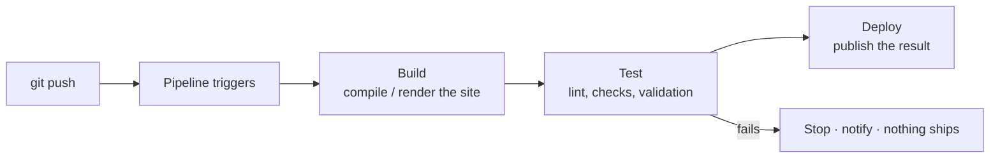

The final piece. **CI/CD** — Continuous Integration / Continuous Delivery — automates the path
from "I pushed a change" to "the change is built, tested, and deployed," with no human running
steps in between. You'll run a **self-hosted** pipeline on your own git server, and the capstone
dogfoods the whole idea beautifully: **a pipeline that rebuilds and redeploys *this documentation
site* every time you push.** Your infrastructure will deploy your infrastructure's docs — the
closed loop from [Module 6](/modules/06-selfhosting/), now automated.

## What a pipeline is

A **pipeline** is a sequence of automated steps triggered by an event — almost always a **git
push** (or a pull request). The classic shape:



- **CI (Continuous Integration)** — every change is automatically **built and tested** the moment
  it's pushed, so problems surface immediately instead of piling up. The gate: if the build or
  tests fail, the change is blocked and you're notified — broken code never proceeds.
- **CD (Continuous Delivery/Deployment)** — changes that pass are automatically **deployed**. Push
  a fix, and minutes later it's live, with no manual steps to forget or fat-finger.

This is [Lesson 7.1](/modules/07-automation/scripting/)'s automation triggered by an *event*
instead of a clock, wired into the GitOps flow from
[Lesson 7.3](/modules/07-automation/gitops/): the pipeline watches git and acts on what lands
there.

## Self-hosted runners — keeping it yours

A **runner** is the machine (or container) that executes your pipeline's steps. In line with the
curriculum's self-hosting ethos, you'll run your own on your own hardware:

- **Forgejo Actions** — your [Module 6](/modules/06-selfhosting/services/) git server has CI built
  in, using the same workflow syntax as GitHub Actions. Add a runner and your self-hosted git
  gains a self-hosted pipeline — a tidy, all-in-one setup.
- **Woodpecker CI** — a lightweight, standalone, self-hostable CI system that connects to your git
  server. A great option if you want CI as its own service.

Both keep the entire build-test-deploy loop on infrastructure you control — no third-party CI
service, matching how you self-host everything else.

## What a pipeline looks like

Pipelines are defined as code — a YAML file in your repo (there's that pattern again: the pipeline
*itself* is version-controlled). A workflow to build and deploy a static site
([Module 6](/modules/06-selfhosting/services/)) reads roughly like this:

```yaml
# .forgejo/workflows/deploy.yml (GitHub Actions-compatible syntax)
on:
  push:
    branches: [main]           # trigger on pushes to main

jobs:
  build-and-deploy:
    runs-on: self-hosted        # your own runner
    steps:
      - uses: actions/checkout@v4
      - name: Install dependencies
        run: npm ci
      - name: Build the site
        run: npm run build       # renders to ./dist (your Module 6 site)
      - name: Deploy
        run: |
          rsync -a --delete dist/ /srv/www/site/   # publish to where the proxy serves it
```

Push to `main`, and the runner checks out the code, builds the site, and deploys it — untouched by
human hands. The syntax will feel familiar because it's the same idea you've applied all module:
declare the steps, let the machine execute them idempotently.

## Gates: catching mistakes before they ship

CI's real value is the **gate** — automated checks that must pass before a change deploys. For
this curriculum's site and configs, useful gates include:

- **Linting** — catch syntax/style problems (a broken YAML, a malformed Markdown link).
- **Build success** — if the site doesn't build, don't deploy a broken site.
- **Validation** — e.g. `ansible-playbook --check` ([Lesson 7.2](/modules/07-automation/ansible/)),
  config syntax tests, link checkers.
- **Secret scanning** — `gitleaks` ([Lesson 7.3](/modules/07-automation/gitops/)) to block a
  committed secret before it merges.

Run these on **pull requests** ([Lesson 7.3](/modules/07-automation/gitops/)) and a failing check
blocks the merge — so mistakes are caught *before* they reach `main`, before they reach
production. Recall the [Module 6](/modules/06-selfhosting/) reverse-proxy config that a typo could
break: a pipeline that validates config before deploy is how you stop that typo from taking your
site down — which is exactly the kind of incident you'd otherwise be writing a post-mortem about
([Lesson 0.5](/modules/00-toolkit/writing/)).

:::note[Your homelab is production now]
An important mental shift: once your site and services are live and you (or an employer) rely on
them, **your homelab is production.** Changes deserve the same care a company would apply —
review, tested config, automated gates, safe deploys. Treating your homelab as production, and
building the pipeline discipline to match, is precisely the experience that makes you employable.
The stakes are low enough to learn safely and real enough to matter.
:::

## The dogfooding capstone

Here's the finale that ties the whole curriculum together
([Lab 5](/modules/07-automation/labs/#lab-5--the-self-deploying-site)): wire a CI/CD pipeline, on
your own runner, that **rebuilds and redeploys your documentation site on every push to main.**

Sit with what that means. Your site — the one hosting all your writeups, the closed loop from
[Module 6](/modules/06-selfhosting/) — is built from code in your self-hosted git, and now a
pipeline on your own hardware redeploys it automatically whenever you change it. You fix a typo,
push, and watch it go live untouched by hand. The infrastructure you built now *operates itself*
in response to your commits. That is CI/CD, that is GitOps, and that is the DevOps loop, running
in your home on hardware you own.

## The whole-lab rebuild

The other capstone thread ([Lab 3](/modules/07-automation/labs/#lab-3--whole-lab-rebuild)):
combine everything — Ansible playbooks, Compose files, and a pipeline — so that
`ansible-playbook site.yml` (plus your CI) can **reconstruct your entire homelab from bare VMs.**
Wipe a VM, run one command, and watch it become a configured, hardened, service-running server.
Recording that — a bare VM becoming your homelab via one command — is the module's deliverable and
the single most persuasive thing you can show an employer: undeniable proof you can define, build,
and operate infrastructure as code.

## Quick self-check

1. What triggers a CI/CD pipeline, and what are the typical build → test → deploy stages?
2. What's the difference between the CI part and the CD part?
3. What is a runner, and why run your own?
4. What is a "gate," and why run gates on pull requests specifically?
5. What does "your homelab is production now" change about how you make changes?
6. Describe the two capstones (self-deploying site, whole-lab rebuild) and why each is persuasive
   to an employer.

**Next:** [The Labs →](/modules/07-automation/labs/) — where your infrastructure becomes code that
rebuilds and deploys itself.
