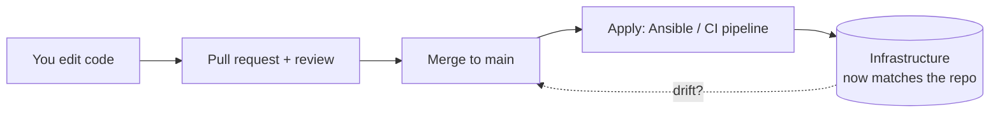

You now have your infrastructure as code — Compose files ([Module 6](/modules/06-selfhosting/))
and Ansible playbooks ([Lesson 7.2](/modules/07-automation/ansible/)). This lesson is about the
*discipline* around that code: treating your git repository as the **single source of truth** for
your infrastructure (the idea called **GitOps**), reviewing changes even when you're a team of
one, and — critically — handling the secrets that this code needs without ever committing
plaintext. Getting secrets right is both a Module 7 skill and a Module 8 security control, and
it's where a lot of real breaches begin.

## GitOps: the repo is the desired state

**GitOps** is a simple, powerful idea: your git repository is the **single source of truth** for
what your infrastructure *should* be. You don't change servers directly; you change the code in
git, and the system is brought into line with the repo. It's the natural conclusion of everything
you've built:



The consequences of this mindset are all good:

- **The repo describes reality.** Want to know how a server is configured? Read the repo, not the
  server. The [Lesson 2.4](/modules/02-server/operating/) question "what changed?" is answered by
  `git log` — because *nothing* changes except through git.
- **Changes are reviewable and reversible.** Every change is a commit: you can see it, review it,
  and `git revert` it ([Lesson 0.4](/modules/00-toolkit/git/)) if it breaks something.
- **No more mystery drift.** When servers are only changed through the repo, they don't silently
  drift into undocumented, unreproducible states — the "works on that one server nobody dares
  touch" problem disappears.

This is why the curriculum has insisted on committing configs since [Module 0](/modules/00-toolkit/git/).
It was never busywork — it was building toward *this*: infrastructure whose truth lives in
version control.

## Review, even as a team of one

Here's a habit that feels unnecessary solo but pays off enormously: use **branches and pull
requests** for infrastructure changes, and review your own PRs before merging — on your own git
server from [Module 6](/modules/06-selfhosting/services/).

Why review your own code?

- **A PR forces a second look.** Reading your change as a reviewer — a diff, deliberately —
  catches the committed secret, the typo in the firewall rule, the thing you meant to remove.
  It's a structured pause before change hits your infrastructure (the same spirit as
  `--check` and `mount -a`).
- **It builds the muscle for teams.** On any real team, all changes go through PR review. Being
  fluent in the branch → PR → review → merge flow ([Lesson 0.4](/modules/00-toolkit/git/)) is
  table-stakes professionally, and practicing it solo means you arrive ready.
- **The PR is a record.** The discussion and the diff document *why* a change was made — future
  archaeology made easy, complementing your ADRs ([Lesson 5.4](/modules/05-overlay/choosing/)).

Your CI pipeline ([Lesson 7.4](/modules/07-automation/cicd/)) will hook into this: a PR triggers
automated checks *before* you merge, so mistakes are caught before they ever reach production.

## Secrets: the problem, restated with stakes

Your infrastructure code needs secrets — a database password in a Compose `.env`, an API token
for DNS-01 ([Lesson 6.3](/modules/06-selfhosting/tls/)), SSH keys, the restic repository password
([Lesson 4.3](/modules/04-storage/backups/)). But all this code lives in git, and — the iron rule
since [Lesson 0.4](/modules/00-toolkit/git/) — **secrets must never be committed in plaintext.**

The stakes, restated because this is where real breaches start: git history is **permanent and
distributed**. A secret committed and pushed is compromised *forever*, even if you delete it in a
later commit — it's in the history, on every clone, on your git server. Public repos get scraped
for exactly this within minutes. The only real remedy is **rotation** (invalidate it, issue a new
one) — which is why this reappears as a drill in [Module 8](/modules/08-security/).

So how do you keep secrets *next to* the code that needs them without exposing them? Two good
approaches:

## Approach 1 · Encrypted secrets in git (sops + age)

The elegant modern answer: encrypt the secrets and commit the *encrypted* file. **sops** (with
**age** for the keys) encrypts individual values in a YAML/JSON file, so you can safely commit it —
the file is in git, readable structure and all, but the secret *values* are ciphertext that only
someone with the decryption key can read.

```sh
# Encrypt a secrets file — the values become ciphertext, safe to commit
sops --encrypt --age <public-key> secrets.yml > secrets.enc.yml
git add secrets.enc.yml          # committing ENCRYPTED secrets is fine

# On the server / in CI, decrypt at deploy time with the private key
sops --decrypt secrets.enc.yml
```

This is genuinely nice: your secrets are version-controlled *alongside* your code, fully
auditable, but useless to anyone without the age key. Ansible integrates with this pattern (and
has its own **Ansible Vault** doing the same job — encrypting variables files). The decryption key
itself lives *outside* git, on the machines that need it.

## Approach 2 · Keep secrets out of git entirely

Simpler, and fine for a homelab: the secrets never enter the repo at all.

- A **gitignored `.env` file** ([Lesson 6.1](/modules/06-selfhosting/docker/)) on the server holds
  the real values; you commit a `.env.example` with placeholders. This is the pattern you already
  used in Module 6.
- A **secrets manager** — Vaultwarden ([Lesson 6.4](/modules/06-selfhosting/services/)) for
  human-used secrets, or a dedicated tool like HashiCorp Vault for larger setups — stores secrets
  centrally and hands them out at runtime.

:::danger[The one rule, and the one reflex]
**Rule:** no plaintext secret ever gets committed. Enforce it with `.gitignore` from the start of
every repo, and consider a pre-commit secret scanner (`gitleaks`) so a mistake is caught before
it's pushed.

**Reflex:** if a secret *is* ever exposed — pushed by accident, leaked in a log, shown in a
screenshot — **rotate it immediately.** Don't just delete the commit and hope; assume it's
compromised, because it is. Building this reflex now, on a throwaway secret, is exactly
[Module 8](/modules/08-security/)'s leak drill — and it's the difference between a non-event and
an incident.
:::

## Where this leaves you

Your infrastructure is now code, in a repository that is its source of truth, changed through
reviewed pull requests, with secrets encrypted or externalized so plaintext never touches git.
That's a genuinely professional setup — many working teams aren't fully there. It's also exactly
the substrate CI/CD needs: because everything meaningful happens through git, an automated
pipeline can watch git and *act* on changes. That's the final lesson.

## Quick self-check

1. What does "the repo is the single source of truth" (GitOps) mean in practice?
2. How does GitOps make the [Lesson 2.4](/modules/02-server/operating/) question "what changed?"
   easy to answer?
3. Why review your own pull requests when you're a team of one? Give two reasons.
4. Why is a secret, once committed and pushed, considered compromised forever?
5. Explain the sops/age approach: what's safe to commit, and where does the key live?
6. What are the rule and the reflex for handling secrets, and how do they connect to Module 8?

**Next:** [Lesson 7.4 · CI/CD Pipelines →](/modules/07-automation/cicd/)
