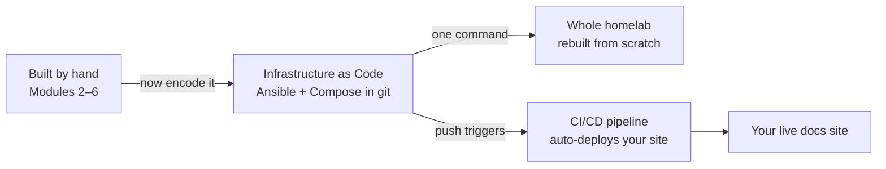

You built everything by hand so you'd *understand* it. Now you'll automate it so you never have
to do it by hand again. That single sentence is the entire DevOps philosophy, and this module
makes it muscle memory. The payoff is concrete and a little magical: by the end you'll be able
to **destroy your whole homelab and rebuild it from code** — and a push to your docs repo will
deploy your site automatically, with no manual steps.

This is the "Dev" in DevOps arriving in force. Everything you configured by hand in Modules 2–6
becomes text in a repository that *is* the source of truth for your infrastructure.

## The arc this module completes

The curriculum has repeated one shape — *build by hand, then automate* — and here it pays off in
full:

You did it manually to learn it. You automate it because that's the profession: manual work
doesn't scale, isn't repeatable, and can't be reviewed. Code does all three.

## What you need

- Your homelab from [Module 6](/modules/06-selfhosting/): a hardened server (or Proxmox host with
  VMs), services in Compose files, a self-hosted git server, your live site.
- A workstation with `ansible` installed (your Module 0 machine).
- A few **throwaway VMs** on your Proxmox host ([Module 4](/modules/04-storage/)) to test
  automation against — because the whole point is proving you can rebuild from nothing.

## The lessons

| Lesson | Topic | Time |
|---|---|---|
| [7.1 · Scripting Glue](/modules/07-automation/scripting/) | Robust shell + Python, idempotency, scheduling | 4–5 hrs |
| [7.2 · Infrastructure as Code](/modules/07-automation/ansible/) | Ansible: declarative, idempotent server config | 6–8 hrs |
| [7.3 · GitOps & Secrets](/modules/07-automation/gitops/) | The repo as source of truth; secrets done right | 4–5 hrs |
| [7.4 · CI/CD Pipelines](/modules/07-automation/cicd/) | Automated build → test → deploy, self-hosted | 5–7 hrs |
| [Labs](/modules/07-automation/labs/) | The five graded exercises | 10–14 hrs |

Total: roughly **30–40 hours**, or 3–4 weeks part-time.

## Checkpoint

- [ ] I write idempotent automation and can explain why idempotency matters
- [ ] My server's entire configuration, including hardening, lives in an Ansible repo
- [ ] I can rebuild my homelab from code onto fresh VMs
- [ ] No plaintext secret exists in any of my repositories
- [ ] A push to my docs repo deploys the site automatically, with no manual steps
- [ ] I use pull requests and review my own changes before merge

## Deliverable

**An Ansible repository that rebuilds Modules 2–6 from scratch**, plus a working CI/CD pipeline
that auto-deploys your site. Record a short screen capture of a bare VM becoming a configured
server via one command — it's the most persuasive thing in your portfolio. Full spec in
[Lab 5](/modules/07-automation/labs/#lab-5--the-self-deploying-site).

## Resources

- [Ansible documentation](https://docs.ansible.com/) — start with "getting started," ignore the rest until needed
- [sops](https://github.com/getsops/sops) + [age](https://github.com/FiloSottile/age) — modern secrets, minimal ceremony
- [Woodpecker CI](https://woodpecker-ci.org/) / Forgejo Actions — lightweight self-hosted pipelines
- Google's [*Site Reliability Engineering*](https://sre.google/books/) book — read the chapter on toil
