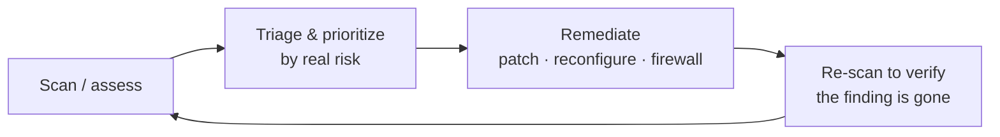

You can't defend what you can't see. This lesson teaches you to look at your own homelab the way
an attacker would — enumerating what's exposed, scanning for services, assessing for known
vulnerabilities — and then, crucially, to *fix what you find and verify the fix*. This is
defensive security done by borrowing offensive techniques, on a target you own. You already met
the gentle version (`nmap` after hardening in [Lesson 2.3](/modules/02-server/hardening/)); now
you go deeper and systematic.

:::caution[Authorized target only]
Everything here runs against **your own lab** ([Lesson 8.0](/modules/08-security/ethics/)) — your
servers, your isolated practice VLAN. Never against anything you don't own. This is the point of
having built your own infrastructure: it's a target you're fully authorized to assess.
:::

## Reconnaissance: knowing what's there

The first thing an attacker does — and therefore the first thing *you* should do to your own
network — is **enumerate** what exists: which hosts are up, what services they run, what versions.
For your own lab this is really an *inventory* exercise, and it's humbling: most people discover
services running they'd forgotten about, which is exactly the point.

Your primary tool is **nmap** (the network mapper), which you've used lightly before:

```sh
nmap -sn 192.168.20.0/24            # host discovery — which IPs are alive on this subnet?
nmap 192.168.20.10                  # default scan — common ports on one host
nmap -p- 192.168.20.10              # ALL 65535 ports, not just common ones
nmap -sV 192.168.20.10              # service/version detection — what's running, which version
nmap -sV -O 192.168.20.10           # also guess the operating system
nmap -A 192.168.20.10               # aggressive: version, OS, scripts, traceroute
```

Read the results against your [Module 3](/modules/03-network/) network diagram and your
[Module 2](/modules/02-server/) build logs. The questions to ask about *every* open port:

- Do I know what this service is and why it's running?
- Should it be exposed on this network segment at all (recall
  [segmentation](/modules/03-network/segmentation/))?
- Is it the version I think it is, and is it patched?

An open port you can't explain is a finding. This ties directly back to the hardening goal from
[Lesson 2.3](/modules/02-server/hardening/): *only the ports you can name and justify should be
open.* Now you're verifying that at network scale.

## Vulnerability assessment: known weaknesses

Scanning tells you what's *there*; **vulnerability scanning** tells you what's *weak* — matching
your services and versions against databases of known vulnerabilities (**CVEs**). The homelab-grade
tools:

- **OpenVAS / Greenbone** — a full open-source vulnerability scanner. You run it against your own
  hosts and it produces a report of findings, each with a severity and a description.
- **Nessus Essentials** — a free tier of the industry-standard commercial scanner, usable on a
  limited number of your own IPs.
- **Lynis** — a host-based auditing tool you run *on* a server to check its own hardening and
  configuration.

These generate a **findings report** — a prioritized list of issues. Learning to *read* one is a
real skill:

- **Severity is a starting point, not gospel.** Scanners rate findings (often by CVSS score), but
  a "critical" on a service only reachable from your isolated lab VLAN is less urgent than a
  "medium" on your internet-facing box. **Prioritize by real risk in your context** — what's
  exposed, what's the blast radius — not by the number alone.
- **Expect false positives.** Scanners guess; some findings won't actually apply. Part of the
  skill is investigating rather than blindly trusting.
- **Map findings to fixes.** Each real finding should map to an action: patch it, reconfigure it,
  firewall it off, or accept the risk with a documented reason.

:::note[This is exactly what a "vulnerability management" job is]
Scan → triage → prioritize by real risk → remediate → re-scan to verify. That loop *is* a whole
category of security jobs. Doing it on your own lab — and being able to show a findings report
with before/after remediation — is directly demonstrable experience for those roles.
:::

## The fix loop: the part that matters

Finding problems is only valuable if you fix them. The discipline — and the thing that turns
assessment from a hobby into a skill — is the **remediation loop**:



For each finding you decide to fix:

1. **Understand it** — what's the actual weakness and how could it be abused?
2. **Remediate** — using your earlier-module skills: patch via the package manager
   ([Lesson 2.2](/modules/02-server/anatomy/)), tighten a firewall rule
   ([Lesson 2.3](/modules/02-server/hardening/) / [3.3](/modules/03-network/segmentation/)),
   fix a config, or remove the service if you don't need it.
3. **Re-scan to verify** — run the scan again and confirm the finding is *gone*. Unverified fixes
   aren't fixes (the same principle as testing restores in
   [Lesson 4.3](/modules/04-storage/backups/)).
4. **Record it** — before/after evidence, so you can show the loop working.

That before/after — "here's the finding, here's the fix, here's the clean re-scan" — is the core
of [Lab 1](/modules/08-security/labs/#lab-1--self-assessment) and a genuinely persuasive portfolio
artifact. It demonstrates you don't just run scanners; you *close findings*.

## Web application basics: the OWASP Top 10

Many of your self-hosted services ([Module 6](/modules/06-selfhosting/)) are web apps, and web
apps have their own common weaknesses. The **[OWASP Top 10](https://owasp.org/www-project-top-ten/)**
is the industry's canonical list of the most common web vulnerability classes — injection,
broken access control, security misconfiguration, and so on. You don't need to master
exploitation; you need to *recognize* these categories and check your own services against them.
The intentionally-vulnerable **DVWA** from [Lesson 8.0](/modules/08-security/ethics/) is the safe,
legal place to *see* these vulnerabilities in action and understand what you're defending against.

## Where this leads

Assessment gives you a clear, current picture of your lab's weaknesses and a loop for closing
them — the "scan and harden" half of security operations. But a fixed vulnerability today doesn't
mean you'd *notice* an attack tomorrow. That's the other half: monitoring and detection
([Lesson 8.3](/modules/08-security/monitoring/)), and then proving your detection works by
attacking yourself ([Lesson 8.4](/modules/08-security/purple-team/)). First, though, a focused
look at the weaknesses assessment most often surfaces: identity and secrets.

## Quick self-check

1. Why is enumerating your own network a humbling and useful first step?
2. What does `nmap -sV -p-` tell you that a default `nmap` scan doesn't?
3. What's the difference between a port scan and a vulnerability scan?
4. Why should you prioritize findings by "real risk in context" rather than by CVSS score alone?
5. Describe the four steps of the fix loop. Why is the re-scan essential?
6. What is the OWASP Top 10, and how does DVWA fit into learning it safely?

**Next:** [Lesson 8.2 · Identity & Secrets →](/modules/08-security/identity/)
