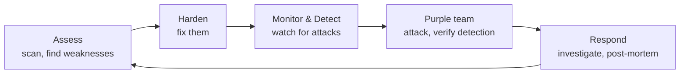

Security wasn't a bolt-on in this curriculum — you've been hardening since
[Module 2](/modules/02-server/hardening/), segmenting since
[Module 3](/modules/03-network/segmentation/), and minding secrets since
[Module 0](/modules/00-toolkit/git/). This module makes security a *discipline*: you'll assess
your own lab like an attacker, build the monitoring and detection an operator needs, and then run
a **purple-team exercise** — attack your own homelab and hunt yourself in the logs. That single
exercise teaches operations and security better than anything else in the curriculum.

Everything here is done against **your own infrastructure**, which is what makes it both safe and
uniquely instructive: you have full context on the target because you built it.

:::danger[Read this before anything else: authorization is everything]
Every offensive technique in this module is for use **only against systems you own or have
explicit written permission to test.** Scanning, probing, or accessing systems you don't own is a
crime under laws like the US Computer Fraud and Abuse Act, the UK Computer Misuse Act, and
equivalents worldwide — regardless of intent. The skill that makes you *employable* (rather than
prosecutable) is knowing exactly where that line is and never crossing it.
[Lesson 8.0](/modules/08-security/ethics/) is mandatory and comes first — it is not optional
throat-clearing; it is the foundation of a security career.
:::

## The lessons

| Lesson | Topic | Time |
|---|---|---|
| [8.0 · Rules of Engagement](/modules/08-security/ethics/) | Ethics, law, authorization, and a safe practice lab | 2–3 hrs |
| [8.1 · Assess](/modules/08-security/assess/) | Recon, scanning, vulnerability assessment, the fix loop | 5–7 hrs |
| [8.2 · Identity & Secrets](/modules/08-security/identity/) | Access hygiene, MFA, and secrets that leak | 3–4 hrs |
| [8.3 · Monitor & Detect](/modules/08-security/monitoring/) | Prometheus/Grafana, central logs, detection rules | 6–8 hrs |
| [8.4 · Purple Team & Incident Response](/modules/08-security/purple-team/) | Attack your lab, find it in the logs, write the post-mortem | 6–8 hrs |
| [Labs](/modules/08-security/labs/) | The six graded exercises | 10–14 hrs |

Total: roughly **35–45 hours**, or 4–5 weeks part-time.

## The idea that ties it together

Security operations is a loop, not a checklist:

You assess, you harden, you watch, you *test that your watching works*, you respond and learn —
and then you go around again. The purple-team exercise is the hinge: it's where you prove your
monitoring actually catches something, by being the attacker yourself.

## Checkpoint

- [ ] I can state, precisely, what I am and am not legally allowed to test
- [ ] I regularly scan my own lab and remediate findings, with before/after proof
- [ ] No secret lives in plaintext or in git history; I know how to rotate one
- [ ] My homelab has metrics dashboards and alerts that reach me
- [ ] My hosts ship logs centrally and I have at least one working detection rule
- [ ] I've run a purple-team exercise and found (most of) my own attack in the logs
- [ ] I can write a clear, blameless post-mortem

## Deliverable

**A purple-team report + post-mortem**: your attack narrative, the detection evidence (dashboard
and log screenshots), an honest account of what you *missed*, the gaps you closed, and a blameless
incident write-up. This is the single most impressive artifact for a security-track interview.
Full spec in [the labs](/modules/08-security/labs/#lab-5--purple-team).

## Resources

- [TryHackMe](https://tryhackme.com/) / [Hack The Box](https://www.hackthebox.com/) — legal, sandboxed practice targets
- [OWASP Top 10](https://owasp.org/www-project-top-ten/) — the vulnerabilities you'll actually meet
- [Wazuh](https://wazuh.com/) / [Security Onion](https://securityonionsolutions.com/) — free SIEM platforms for the home lab
- [MITRE ATT&CK](https://attack.mitre.org/) — the shared language of detection
