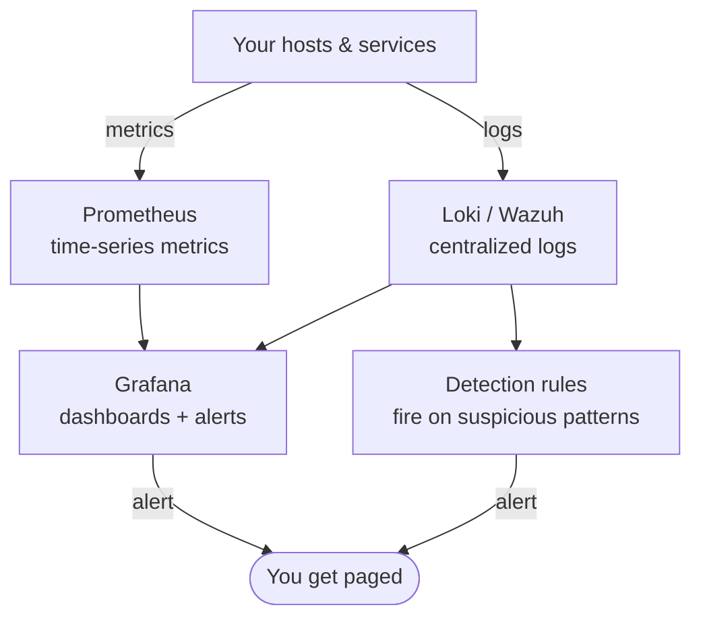

You can't respond to what you can't see. This lesson builds the eyes and ears of your homelab:
**monitoring** (is everything healthy?) and **detection** (is someone attacking?). These are
related but distinct disciplines, and both are core to operations *and* security roles. By the
end you'll have dashboards that show your homelab's health, alerts that reach you before things
break, centralized logs, and at least one **detection rule** that fires on suspicious activity —
a small but real **SOC** (Security Operations Center) for your lab.

## Monitoring vs. detection: related, not the same

Keep these two ideas distinct — they answer different questions:

- **Monitoring / observability** — *Is the system healthy?* CPU, memory, disk
  ([Lesson 1.1](/modules/01-fundamentals/machine/) / [2.4](/modules/02-server/operating/)), service
  uptime, response times, certificate expiry. This is operations: catch problems before users do.
- **Detection** — *Is someone attacking?* Failed logins, unexpected new listening ports, a process
  that shouldn't be running, access at odd hours. This is security: notice adversary activity.

They overlap (both consume metrics and logs) but the mindset differs: monitoring watches for
*things breaking*, detection watches for *someone doing something bad*. A mature setup does both.

## Monitoring: Prometheus + Grafana

The de-facto open-source monitoring stack, and a genuinely valuable thing to have on a résumé:

- **Prometheus** — collects and stores **metrics** as time series. Agents called *exporters*
  (e.g. `node_exporter` for host CPU/memory/disk) expose numbers; Prometheus scrapes and stores
  them. It's the same four-resource model from
  [Lesson 1.1](/modules/01-fundamentals/machine/), now graphed over time across all your hosts.
- **Grafana** — turns those metrics into **dashboards** — the graphs of CPU, memory, disk, service
  health you'll actually watch. It also handles **alerting**.

Deploy both as containers ([Module 6](/modules/06-selfhosting/docker/)) with `node_exporter` on
each host. Build a dashboard showing your homelab's vital signs at a glance
([Lab 3](/modules/08-security/labs/#lab-3--dashboards)).

### Alerting: get told *before* it's a crisis

A dashboard only helps when you're looking at it. **Alerts** reach out to you when a condition is
met — the difference between finding out at 2am from Grafana and finding out at 9am from an angry
user. Wire up alerts that actually page you (email, push, a chat webhook) for conditions like:

- Disk above 85% ([Lesson 2.4](/modules/02-server/operating/) — a full disk is a classic outage).
- A service down, or memory exhausted.
- **A TLS certificate expiring within 14 days** — recall
  [Lesson 6.3](/modules/06-selfhosting/tls/): a failed auto-renewal is invisible until the cert
  expires and the site breaks. This alert is exactly the fix, and closing that loop
  ("automate renewal *and* monitor expiry") is a mark of someone who operates systems, not just
  sets them up.

## Detection: the security half

Now the security-specific side. Detection needs **logs** brought together where you can search and
alert on them — because an attacker's activity shows up in logs across many hosts, and (recall
[Lesson 2.4](/modules/02-server/operating/)) an attacker's *first* move is often to cover their
tracks in the local logs.

### Centralize the logs

Ship logs from all your hosts to one place, so they're searchable together and safe from
local tampering:

- **Loki** — Grafana's log aggregation system; pairs naturally with the Prometheus/Grafana stack
  so metrics and logs live in one dashboard.
- **Wazuh** or **Security Onion** — full open-source **SIEM** (Security Information and Event
  Management) platforms that collect logs, apply detection rules, and give you a security-focused
  console. Heavier, but they give you the real "SOC analyst" experience in your own lab.

:::note[Why centralized logs matter for security, not just ops]
Two reasons beyond convenience. First, **correlation**: an attack often looks innocuous on any one
host but obvious when you see the pattern across all of them together. Second, **integrity**: if
logs only live on the host that gets compromised, the attacker can delete them
([Lesson 2.4](/modules/02-server/operating/)). Shipping logs off the host in real time means the
evidence survives even if the host is owned — which is precisely what lets you reconstruct an
attack in [Lesson 8.4](/modules/08-security/purple-team/).
:::

### Write a detection rule

Here's where you go from collecting logs to *detecting* — writing a rule that fires an alert on a
suspicious pattern. Start with one good, concrete rule. Classic examples for a homelab:

- **SSH brute-force** — alert when there are many failed logins from one IP in a short window
  (recall the `auth.log` failed-login stream from [Lesson 2.4](/modules/02-server/operating/) that
  fail2ban was quietly handling — now *you* detect and alert on it).
- **A new listening port appears** — something started listening that wasn't before (`ss -tunlp`
  from [Lesson 1.2](/modules/01-fundamentals/tcpip/)) — often a sign of a planted backdoor.
- **Access at unusual hours** or from an unexpected network segment
  ([Lesson 3.3](/modules/03-network/segmentation/)).

Writing one detection rule, and then *triggering it deliberately* to confirm it fires, is
[Lab 4](/modules/08-security/labs/#lab-4--central-logging) — and it's the foundation of the
purple-team exercise next lesson.

## MITRE ATT&CK: the shared language

As you think about *what* to detect, the **[MITRE ATT&CK](https://attack.mitre.org/)** framework
is the industry's shared catalog of attacker techniques — how real adversaries do reconnaissance,
gain access, persist, move laterally, and exfiltrate. It's the common vocabulary detection
engineers use to reason about coverage ("do we detect lateral movement?"). You don't need to
memorize it, but knowing it exists and framing your detection rules against real techniques is how
professionals think — and name-checking it correctly signals you understand the field.

## What you've built

A homelab that watches itself: metrics and dashboards showing health, alerts that reach you before
problems bite, centralized tamper-resistant logs, and at least one detection rule that fires on
adversary behavior. That's a functioning mini-SOC — and it's the setup you *test* in the next
lesson by attacking your own lab and checking whether your eyes and ears actually caught it.

## Quick self-check

1. What different questions do monitoring and detection each answer?
2. What do Prometheus and Grafana each do in the monitoring stack?
3. Why is a certificate-expiry alert the natural completion of the Lesson 6.3 TLS story?
4. Give two reasons centralized logging matters for security specifically, not just convenience.
5. Describe one concrete detection rule and what attacker behavior it catches.
6. What is MITRE ATT&CK, and how do detection engineers use it?

**Next:** [Lesson 8.4 · Purple Team & Incident Response →](/modules/08-security/purple-team/)
