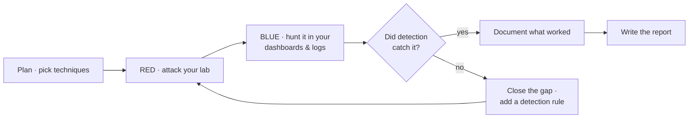
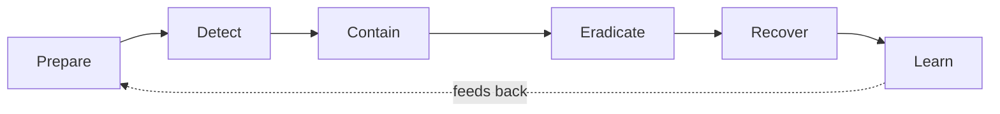

This is the capstone of the security module and, arguably, the single most instructive exercise
in the whole curriculum. You'll play both sides: **red** (attack your own lab) and **blue**
(detect and investigate it), which is what "**purple team**" means. Then you'll practice
**incident response** — investigating a compromise and writing a blameless post-mortem. Doing both
roles, on infrastructure you built, teaches operations and security together in a way nothing else
can, because you see the attack *and* what it looks like from the defender's side.

:::caution[Your isolated lab only]
This entire lesson happens in the **isolated practice lab** from
[Lesson 8.0](/modules/08-security/ethics/) — your own targets, on a segmented VLAN, that you're
fully authorized to attack. Nothing here touches your real production services or anything you
don't own. Snapshot your targets first ([Lesson 4.4](/modules/04-storage/virtualization/)) so you
can reset them.
:::

## Red, blue, purple

Three terms from the security world:

- **Red team** — plays the attacker, trying to break in and achieve objectives.
- **Blue team** — plays the defender, monitoring, detecting, and responding.
- **Purple team** — the two working *together* (or, for you, one person switching hats): red
  attacks, blue observes, and both learn where detection worked and where it didn't. The goal
  isn't "did red win" — it's *improving detection*.

For a solo learner, purple teaming is perfect: you attack, then switch to defender and see whether
your [Lesson 8.3](/modules/08-security/monitoring/) monitoring and detection actually caught you.
Every gap you find is a lesson no book could teach as vividly.

## The exercise

### Red: attack your own lab

From your attacker box, run a realistic attack chain against your sacrificial target(s) — the
same techniques from [Lesson 8.1](/modules/08-security/assess/), now used end-to-end and framed
against real adversary behavior ([MITRE ATT&CK](https://attack.mitre.org/)):

1. **Reconnaissance** — scan the target (`nmap`), enumerate services.
2. **Gain a foothold** — exploit a *deliberately planted* weakness: a weak SSH password on the
   sacrificial box, an intentionally-vulnerable app (DVWA), or a known-vulnerable service you set
   up to be beaten. (You're not developing zero-days; you're exercising detection against known,
   planted weaknesses.)
3. **Do something an attacker would** — create a user, start a listener on a new port, read a
   "sensitive" file you planted, attempt to move toward another host on the lab VLAN
   (lateral movement — and note whether your [segmentation](/modules/03-network/segmentation/)
   stops it).

Keep notes on exactly what you did and when — timestamps matter for the blue phase.

### Blue: hunt yourself in the logs

Now switch hats. *Without* using your attacker's notes as a crutch, go to your
[Lesson 8.3](/modules/08-security/monitoring/) tools — the Grafana dashboards, the centralized
logs, your detection rules — and reconstruct what happened:

- Did an alert fire? (Did your SSH brute-force rule catch the foothold?)
- Can you find the reconnaissance scan in the logs?
- Can you see the new user, the new listening port, the file access?
- Can you build a **timeline** of the attack purely from your defensive evidence?

Then the crucial question: **what did you miss?** Almost certainly, some of your attack left no
trace you can find — no rule fired, no log captured it. *That gap is the most valuable output of
the entire exercise.* It's the difference between "I have monitoring" and "I know exactly what my
monitoring does and doesn't catch."

### Close the gaps, and go again

For each thing you missed: add a detection rule, ship a log you weren't collecting, tune an alert.
Then **run the attack again** and confirm you now catch what you missed. This iterate-to-improve
loop is *literally the job* of a detection engineer, and you're doing it for real on your own lab.

## Incident response: the disciplined version

Purple teaming shows you attacks in your logs. **Incident response (IR)** is the disciplined
process for handling a real one. The standard lifecycle:

- **Prepare** — the monitoring, logging, and runbooks you built *before* an incident (this whole
  module).
- **Detect** — notice it (your Lesson 8.3 detection).
- **Contain** — stop it spreading (isolate the host — your [segmentation](/modules/03-network/segmentation/)
  helps; disable an account).
- **Eradicate** — remove the attacker's access and any persistence they planted.
- **Recover** — restore to a known-good state — from your *tested* backups
  ([Lesson 4.3](/modules/04-storage/backups/)) or a clean rebuild from *code*
  ([Module 7](/modules/07-automation/)). This is where all that discipline pays off in an actual
  crisis.
- **Learn** — the post-mortem.

Practice this by investigating a compromise — either the one you caused in the purple-team
exercise, or a prepared "already-compromised" VM image where you play detective and reconstruct
what an attacker did from the evidence they left ([Lab 6](/modules/08-security/labs/#lab-6--post-mortem)).

## The post-mortem: blameless and factual

The final output of any incident is a **post-mortem** — and you already know how to write one from
[Lesson 0.5](/modules/00-toolkit/writing/). The defining principle bears repeating because it's a
genuine cultural value in the field:

:::note[Blameless is the whole point]
A post-mortem's goal is to improve the *system and process*, never to blame a person. "The
engineer made a mistake" is useless; "the system allowed a single mistake to cause an outage, and
here's the guardrail we're adding" is how organizations actually get more resilient. A blameless,
factual post-mortem — clear timeline, honest root cause, concrete action items — demonstrates a
maturity that junior candidates almost never show. Interviewers notice it immediately.
:::

Your post-mortem covers: a plain-language summary, a timeline (from your logs and notes), the root
cause, what detection caught and what it *missed*, and concrete action items — several of which are
the detection gaps you found and closed. This document, plus your purple-team report, is the
module deliverable.

## Why this is the most valuable exercise in the curriculum

Step back and see what you just did: you attacked infrastructure you built, tried to detect
yourself with monitoring you deployed, found the gaps in your own defenses, closed them, and
documented the whole thing as a professional would. That single loop exercises *everything* — the
networking, the systems, the automation, the security — and it's exactly what SOC analysts,
detection engineers, and incident responders do for a living. Being able to walk an interviewer
through your own purple-team report, honest about what you missed and what you fixed, is a
demonstration of real competence that almost no entry-level candidate can offer.

## Quick self-check

1. What does "purple team" mean, and why is it ideal for a solo learner?
2. In the red phase, why do you attack *planted* weaknesses rather than develop new exploits?
3. Why is "what did I miss?" the most valuable output of the blue phase?
4. Walk through the six stages of the incident response lifecycle.
5. In the Recover stage, how do your Module 4 and Module 7 work pay off?
6. What makes a post-mortem "blameless," and why does that matter to employers?

**Next:** [The Labs →](/modules/08-security/labs/) — where you assess, harden, monitor, attack,
and investigate your own lab.
