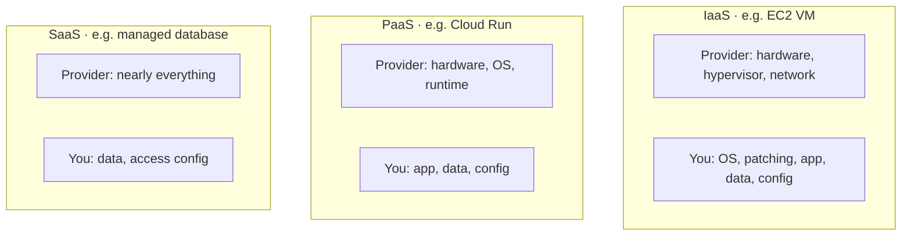

Here's a secret that makes job-hunting far less intimidating: **the cloud is your homelab, rented
by the hour at enormous scale.** Every concept you built by hand has a direct cloud equivalent.
The cloud providers wrap these primitives in branded services with their own names, but
underneath, it's the same networking, servers, storage, and automation you already understand.
Once you can translate between the two vocabularies, cloud job descriptions stop looking like a
foreign language — because you've *built* everything they're describing.

## Why this works

You didn't learn abstractions in this curriculum; you learned *primitives* — what a server, a
subnet, a load balancer, a backup actually is and does. Cloud services are those same primitives,
managed for you. Someone who only ever clicked through a cloud console knows *that* a load
balancer exists; you know *what one is and why*, because you built the reverse proxy it's based
on. That depth is exactly what separates a candidate who can operate the cloud from one who can
only follow its tutorials.

## The mapping

Here's the translation table — the heart of this lesson. Each row is something you *built*, next
to what the cloud calls it:

| You built (module) | The cloud calls it |
|---|---|
| OpenWrt VLANs + firewall ([M3](/modules/03-network/segmentation/)) | VPC, subnets, security groups / network ACLs |
| WireGuard / Tailscale ([M5](/modules/05-overlay/)) | VPN gateway, private networking, zero-trust access (e.g. AWS Client VPN, Cloudflare Access) |
| Your reverse proxy ([M6](/modules/06-selfhosting/reverse-proxy/)) | Load balancer (ALB/ELB) / ingress controller |
| Ansible playbooks ([M7](/modules/07-automation/ansible/)) | Terraform / CloudFormation (declarative infra) |
| Proxmox VMs ([M4](/modules/04-storage/virtualization/)) | EC2 / Compute Engine / Azure VMs |
| Docker Compose stack ([M6](/modules/06-selfhosting/docker/)) | ECS / Cloud Run / Kubernetes (EKS/GKE) |
| restic backups + 3-2-1 ([M4](/modules/04-storage/backups/)) | Object storage snapshots, lifecycle policies (S3 + Glacier) |
| Prometheus + Grafana ([M8](/modules/08-security/monitoring/)) | CloudWatch / managed Prometheus / Cloud Monitoring |
| Your git server + CI/CD ([M7](/modules/07-automation/cicd/)) | GitHub Actions / GitLab CI / CodePipeline |
| Your own DNS ([M3](/modules/03-network/services/)) | Route 53 / Cloud DNS |
| Let's Encrypt + DNS-01 ([M6](/modules/06-selfhosting/tls/)) | ACM (managed certificates) |
| Your hardening + firewall ([M2](/modules/02-server/hardening/)) | Security groups, IAM, hardened AMIs |
| sops/age secrets ([M7](/modules/07-automation/gitops/)) | Secrets Manager / Parameter Store / KMS |

Read that table and notice: **there isn't a single cloud category you haven't already built the
real version of.** That's not a coincidence — it's why hands-on homelab experience translates so
directly to cloud roles.

## The one genuinely new idea: the shared responsibility model

Most of the cloud is your homelab renamed, but there's one concept worth understanding fresh: the
**shared responsibility model.** In your homelab, *you* are responsible for everything — the
hardware, the OS, the network, the app, the data. In the cloud, the provider handles some layers
and you handle others, and *the split depends on the service*:

The security lesson embedded here (and a favorite interview topic): **the provider secures the
cloud; you secure what you put *in* it.** A misconfigured storage bucket, an over-permissive IAM
role, an unpatched VM — those are *your* responsibility, and they're the cause of most cloud
breaches. Your [Module 8](/modules/08-security/) instincts (least privilege, hardening,
assessment) apply directly — you just apply them to cloud resources instead of physical ones.

## Where the homelab still teaches better

It's worth being honest about the flip side, because it's a *strength* of your background: the
cloud *hides* a lot. Someone who only learned on AWS often can't explain what a subnet actually
is, why NAT exists, or what a TLS handshake does — because the console abstracted it away. You
can, because you built it at the bare-metal level. When something breaks in a way the abstraction
didn't anticipate, the person who understands the primitive underneath is the one who fixes it.
Your homelab-first path didn't skip the cloud — it gave you the foundation the cloud sits on.

:::note[How to use this in an interview]
When an interviewer mentions a cloud service, translate out loud: "Right, a VPC — that's like the
segmented network I built with VLANs and firewall zones on OpenWrt, where I..." This does two
things at once: it shows you understand the cloud service, *and* it surfaces the concrete
hands-on experience behind your understanding. That combination — cloud vocabulary backed by
built-it-myself depth — is exactly what hiring managers are listening for.
:::

## Quick self-check

1. Why does building homelab primitives translate so directly to cloud roles?
2. Give the cloud equivalent of: your VLAN segmentation, your Ansible playbooks, your reverse
   proxy, your restic backups.
3. What is the shared responsibility model, and how does the split differ between IaaS and PaaS?
4. Whose responsibility is a misconfigured storage bucket or an over-permissive IAM role?
5. What can someone who built a homelab often explain that a cloud-only learner cannot?
6. How would you weave a homelab-to-cloud translation into an interview answer?

**Next:** [Lesson 9.2 · One Real Cloud Deployment →](/modules/09-career/cloud-deploy/)
