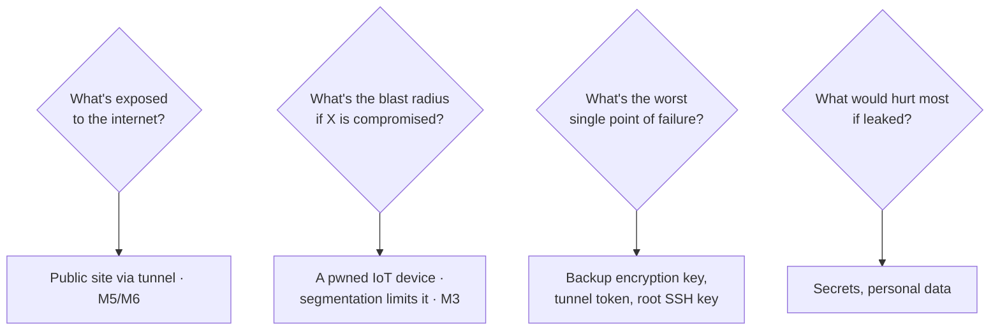

Junior engineers fix vulnerabilities one at a time. Senior engineers reason about *systems of
risk* — what could go wrong, how bad it would be, and where to invest limited effort for the most
protection. That structured reasoning is **threat modeling**, and doing it for your own homelab is
both a genuinely useful exercise and a strong signal of the kind of thinking that gets people
promoted. This short lesson teaches you to look at everything you've built and ask, deliberately:
*what are the threats, and what am I doing about each one?*

## What threat modeling is

Threat modeling is a structured way of answering four questions about a system:

1. **What are we building?** (You know this cold — it's your homelab, and you have the diagrams.)
2. **What can go wrong?** (The threats.)
3. **What are we going to do about it?** (Mitigations.)
4. **Did we do a good job?** (Review.)

It's not about paranoia or listing every conceivable attack — it's about *prioritizing*. You have
limited time; threat modeling tells you where to spend it. This is the mature version of the
"prioritize by real risk, not CVSS" idea from [Lesson 8.1](/modules/08-security/assess/), applied
to your whole system rather than individual findings.

## A lightweight framework: STRIDE

You don't need a heavy methodology for a homelab. A useful prompt is **STRIDE** — six categories of
threat to consider for each part of your system, so you don't miss whole classes of risk:

| Letter | Threat | Homelab example |
|---|---|---|
| **S** | Spoofing (pretending to be someone) | Someone impersonating you to your services — weak auth, no MFA |
| **T** | Tampering (unauthorized changes) | Altering configs or data — why you version-control and back up |
| **R** | Repudiation (denying an action) | No logs to prove what happened — why you centralized logging (M8) |
| **I** | Information disclosure (leaks) | A leaked secret, an exposed service, plaintext data |
| **D** | Denial of service (making it unavailable) | Something knocking a service offline |
| **E** | Elevation of privilege (gaining more access) | A compromised low-priv service reaching root or another VLAN |

Walk each part of your homelab through these six and you'll surface risks systematically instead
of ad hoc.

## Model your own homelab

Here's the exercise ([Lab 3](/modules/09-career/labs/#lab-3--threat-model)). Take your homelab and
reason about it as an attacker's target — thinking about **attack surface** (what's exposed) and
**blast radius** (how bad it is if a given thing is compromised):

Concrete questions worth answering for *your* lab:

- **What's actually reachable from the internet?** After [Module 5](/modules/05-overlay/), ideally
  very little — the tunnel-published site, and nothing else (zero open ports). Confirm it.
- **If my Cloudflare tunnel token leaked, what could an attacker do?** (A real question with a real
  answer — and a reason to keep it secret and rotatable,
  [Lesson 8.2](/modules/08-security/identity/).)
- **If a device on my IoT VLAN is compromised, what can it reach?** Your
  [segmentation](/modules/03-network/segmentation/) should mean "the internet and nothing internal"
  — verify that's still true.
- **What's my single worst point of failure?** Often a key or token — the backup encryption key,
  the root SSH key. What protects it, and what happens if it's lost *or* stolen (two different
  disasters)?
- **What would hurt most if disclosed?** Find your most sensitive data and trace who/what can
  reach it.

## Turn it into a backlog

The output of threat modeling isn't a document that sits on a shelf — it's a **prioritized
remediation backlog**. For each meaningful threat, decide: mitigate it now, mitigate it later, or
*accept* it with a documented reason (accepting risk deliberately is a legitimate, senior
decision — the point is that it's *deliberate*, not accidental). Then knock out the top items.

This connects the whole security arc: threat modeling tells you *where* to point the
[Module 8](/modules/08-security/) tools and effort. Instead of scanning randomly, you assess and
harden the things your model says matter most. That's how security is actually prioritized in the
real world, and being able to say "I threat-modeled my infrastructure and here's the backlog it
produced, and here's what I fixed first and why" demonstrates exactly the risk-based thinking that
marks a senior engineer.

:::note[Why this punches above its weight in interviews]
Most candidates — even ones with certifications — think about security as a list of controls to
apply. Being able to reason about *risk* — attack surface, blast radius, single points of failure,
what to fix first and what to knowingly accept — is a distinctly more senior mode of thinking, and
it's rare in junior candidates. A one-page threat model of your own homelab, with a prioritized
backlog you acted on, is a small artifact that signals a big thing.
:::

## Quick self-check

1. What four questions does threat modeling answer? Which is really the point?
2. What do the six letters of STRIDE stand for, and give a homelab example of one.
3. What's the difference between "attack surface" and "blast radius"?
4. Why is deliberately *accepting* a risk a legitimate (even senior) decision?
5. What's the actual output of a threat-modeling exercise, and how does it connect to Module 8?
6. Why does risk-based reasoning stand out in an interview more than a list of controls?

**Next:** [Lesson 9.4 · Portfolio & Job Hunt →](/modules/09-career/portfolio/)
